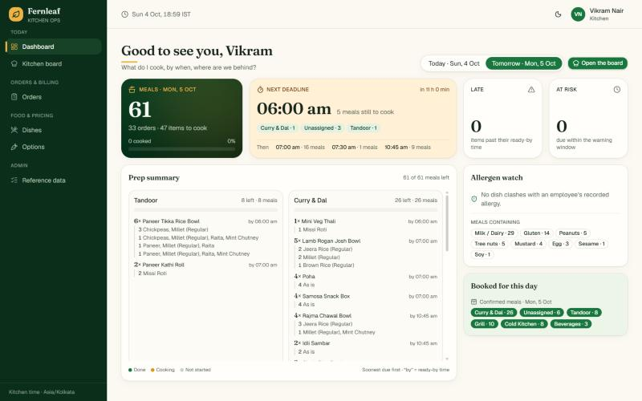
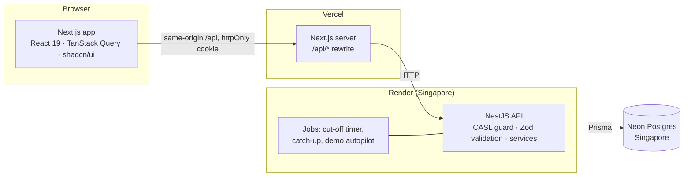
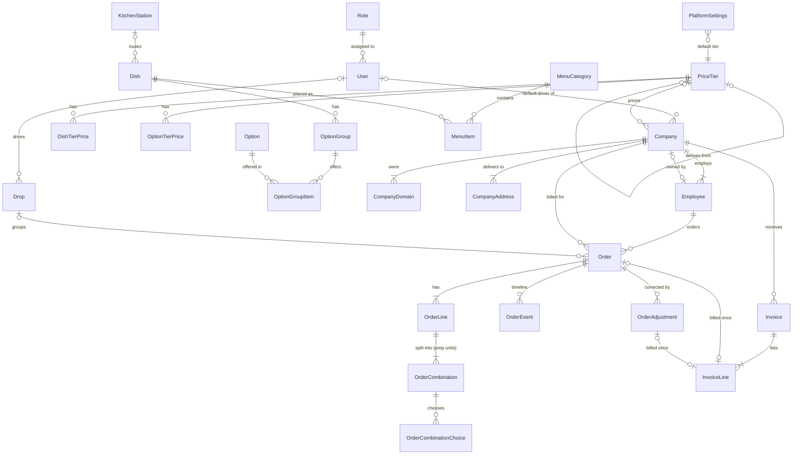

# Fernleaf Kitchen Ops

The internal admin panel for **Fernleaf Kitchen**, a corporate boxed-meal kitchen.

- Staff take orders for client companies' employees.
- The kitchen cooks to a per-station board.
- Dispatch sends drops out with drivers, and drivers deliver from their phones.
- Billing invoices every company.

Built for the Heizen engineering assignment with the mandatory stack: **Next.js** (web) · **NestJS** (API) · **Prisma** (ORM) · **Postgres** (Neon).

- **Live app:** https://kitchen-management-hizen.vercel.app (Vercel)
- **API health:** https://fernleaf-api-l0yq.onrender.com/api/health (Render, Singapore)
- **Time zone:** the kitchen runs on **Asia/Kolkata (IST)**; every date and "today" is computed in IST ([§6](#6-time-zone-money-and-billing-policy)).

### Test accounts (password `Test@1234` for all four)

| Role | Email | What they can do |
|---|---|---|
| Admin | `admin@test.com` | Everything except the driver's own view |
| Kitchen | `kitchen@test.com` | Kitchen dashboard and board; read-only dishes and orders; **no prices** |
| Dispatch | `dispatch@test.com` | Dispatch dashboard and board; read-only companies and orders; **no prices** |
| Driver | `driver@test.com` | Only their own drops for today |

Each account has only its role's access. The server enforces it on every route; the UI only hides what the server would refuse anyway.

| Admin dashboard | Kitchen dashboard | Dispatch board |
|---|---|---|
|  |  |  |

<details><summary>Dark mode (moon icon, top right)</summary>


</details>

---

## Contents

1. [Five-minute tour](#1-five-minute-tour)
2. [Local setup](#2-local-setup)
3. [Architecture](#3-architecture)
4. [Data model](#4-data-model)
5. [Business rules and where they are enforced](#5-business-rules-and-where-they-are-enforced)
6. [Time zone, money and billing policy](#6-time-zone-money-and-billing-policy)
7. [Dashboards: what each one shows, how, and what it leaves out](#7-dashboards-what-each-one-shows-how-and-what-it-leaves-out)
8. [Key decisions and trade-offs](#8-key-decisions-and-trade-offs)
9. [Prioritisation: built, skipped, next](#9-prioritisation-built-skipped-next)
10. [Ambiguities and how I read them](#10-ambiguities-and-how-i-read-them)
11. [Testing](#11-testing)
12. [Demo data](#12-demo-data)
13. [How I worked (and the AI note)](#13-how-i-worked-and-the-ai-note)

---

## 1. Five-minute tour

The data is generated around **today**, whichever day you look: two weeks of delivered history, live work today, and open orders for the next week. A small autopilot moves the *generated* orders along their plans during the day; touch an order or drop yourself and it leaves that one to you.

**As Admin**

1. **Dashboard**: today's progress, the next cut-off (with the drafts it will cancel), what needs you, the week ahead and money owed, all without scrolling.
2. **Orders → New order**: pick Lumen Labs and an employee, add a bowl, split it into *6 × brown rice + 4 × jeera rice*, and watch the server price it live.
3. **Cut-off**: lock times and run history; **Process a date** is safe to repeat.
4. **Pricing**: open *Startup* and tick "Missing only".
5. **Menu preview**: an allergic employee at Lumen Labs, then type the secret slug `chefs-table`.
6. **Billing**: create an invoice; on a delivered order, **Record shortage**.
7. **Companies → a company**: pick a holiday date that already has orders (the warning lists them), or **Import CSV** with the template.

**As Kitchen**

1. **Dashboard**: meals, the next deadline, late and at-risk counts, the prep summary by station and the allergen watch, on one screen. Switch to **Tomorrow** in the title row.
2. **Kitchen board**: station chips, items grouped by ready-by time, red LATE and amber AT RISK, **Start / Done**.
3. Click **Done** on the same item in two tabs: one wins, the other gets a clear conflict message.

**As Dispatch**

1. **Dashboard**: drops by stage, the next departures, what needs a decision, driver load.
2. **Dispatch board**: drops (company + address + exact time), cooked x/y, driver picker, **Mark packed → Send out**.

**As Driver** (open it on a phone)

1. **Dashboard**: the next stop first, with a map link.
2. **My deliveries**: **Mark delivered** with a note and a camera photo; on-time is recorded.

---

## 2. Local setup

**You need:** Node 22, pnpm 10 (via `corepack`), and a Postgres database (a free Neon project works).

```bash
corepack enable
pnpm install
cp backend/.env.example backend/.env       # set DATABASE_URL, DIRECT_DATABASE_URL, JWT_SECRET (32+ chars)
cp frontend/.env.example frontend/.env     # API_ORIGIN=http://localhost:4000
pnpm --filter @fernleaf/backend db:deploy  # apply migrations (incl. CHECK constraints)
pnpm --filter @fernleaf/backend db:seed    # roles, the 4 accounts, settings, catalogue, tiers, menu, companies, employees
pnpm dev                                   # web on :3000, API on :4000
```

- The first API start generates the rolling demo window (about a minute against a remote database).
- `pnpm lint` · `pnpm typecheck` · `pnpm test`: must stay clean. CI runs them on every push, plus `format:check` and `build`.
- `TZ=America/Los_Angeles pnpm --filter @fernleaf/shared test`: the domain rules give the same answers in any server time zone.
- `pnpm --filter @fernleaf/backend db:seed`: idempotent; creates what's missing and never overwrites admin edits.

---

## 3. Architecture



**Repository layout** (pnpm workspaces):

```text
shared/    pure business rules (cut-off, pricing, menu, combinations, billing, prep summary),
           Zod contracts, permission codes and the CASL rules built from them. Used by both apps.
backend/   NestJS 11 API + Prisma 7 (schema, migrations, seed). Owns every transaction.
frontend/  Next.js 16 UI. Talks to the API over HTTP only: no business logic, no database access.
```

**A request, end to end**

1. The browser calls `/api/...` on its own origin; Next.js rewrites it to the API, so the session cookie is first-party and `httpOnly`.
2. One global guard reads the session and rebuilds the user's CASL ability from their role's **permission codes**.
3. Every route declares `@Public`, `@AnyUser` or a policy; the app refuses to boot if one doesn't.
4. The body is validated with the **same Zod schema** the UI uses.
5. The service applies the rules from `shared/` and writes in a transaction.
6. An interceptor strips every `*Cents` field for users without `money.read`.
7. Errors share one envelope `{ error: { code, message, fieldErrors } }`, which the UI maps onto the exact field, line or combination.

**Why this shape**

- The rules live once, as pure functions in `shared/`: the order builder's live quote, the server's validation and the tests run the same code.
- Roles are data. Adding a role is a database change, not a code change, and no code compares role names (a lint rule forbids it).

---

## 4. Data model

46 tables, 30 CHECK constraints. The overview below shows how the main tables relate; the full schema is [`backend/prisma/schema.prisma`](backend/prisma/schema.prisma).



**Modelling choices worth knowing**

- **A combination is the prep unit.** "10 bowls = 6 brown rice + 4 jeera rice" is one order line with two combinations, so the kitchen board shows two cards. Identical combinations are merged under a canonical signature.
- **Orders are snapshots.** Lines store the dish name, SKU and the prices captured when each combination was added; choices store option and size names. Renaming or re-pricing the catalogue never changes history.
- **Exactly one default tier**, as a required foreign key on the settings row: "no default" or "two defaults" can't exist.
- **Drops** (company + address + exact delivery instant) are rows created at confirmation, with the company's default driver. Dispatch acts on a drop; an order's stage is derived from its own and its drop's timestamps.
- **An order or adjustment is on at most one invoice**, enforced by unique keys on `InvoiceLine`; concurrent invoicing of the same order fails for all but one.
- **Nothing that orders point at is deleted**: dishes, options, addresses, employees and companies are deactivated.

---

## 5. Business rules and where they are enforced

Every rule has an ID (such as `BR-CUT-01`), a pure function in `shared/src/domain/`, and tests named after it.

**Cut-off** (`domain/cutoff.ts`, `cutoff.test.ts`)
- An order for date *D* locks at the cut-off time on the *N*th **kitchen working day** before *D*; kitchen holidays are skipped. Wed + N=2 at 16:00 → Mon 16:00.
- N = 0 means the cut-off falls on *D* itself. The company calendar never moves it.

**Locking vs processing** (`orders/cutoff.service.ts`)
- Locking is computed from the clock, so a stale order can never be edited after its cut-off.
- Processing (at the cut-off, on catch-up, or by hand) cancels drafts and confirms placed orders, under a Postgres advisory lock. A second run changes nothing.

**Deliverable dates** (`domain/cutoff.ts`)
- A company working day, not a company holiday, a kitchen working day, not a kitchen holiday, and not in the past (IST).

**After the cut-off** (`orders/orders.service.ts`)
- Non-admins can't create, edit, place or cancel.
- Admins can add a **late order** (created Confirmed, straight into a drop), cancel or reject, and change time, address or packaging until the drop leaves. Lines of a confirmed order are not edited.

**Combinations** (`domain/combinations.ts`)
- Quantities add up to the line; every required group answered; max selections respected; options only from the dish's groups.
- Portioned groups need a size the option supports; minimum order quantities apply.

**Pricing** (`domain/pricing.ts`, `domain/menu.ts`)
- No price on the employee's tier → the dish is absent from their menu (never $0).
- Derived tiers: cost × factor, or another tier ± %, rounded **up** to the next 5¢. Overrides are used exactly as typed; "not sold" is an explicit choice; derivation cycles are refused.

**Employee flags and allergies** (`orders.service.ts`, `combinations.ts`)
- Without "may choose address / change time / change packaging", the company default applies and other values are refused. Times must sit on a delivery-window slot.
- Dishes or options that clash with the employee's allergies are flagged; placing needs an acknowledgement the server checks; the kitchen sees the flag.

**Kitchen** (`kitchen/kitchen.service.ts`: row lock + conditional updates; `domain/kitchen.ts` for the prep summary)
- Only confirmed orders can be worked; start once; "done" without a start records the start.
- Kitchen-ready is set only when the last unit is done; two simultaneous clicks → one success, one 409.

**Dispatch** (`dispatch/dispatch.service.ts`)
- Packed only when every order is cooked; out needs a driver; delivered by the assigned driver (own drops, today) or by dispatch.
- On-time is stored once, at delivery.

**Companies** (`domain/company.ts`, `companies/*`)
- Domains are lower-case, unique across companies, and never a public provider; employee emails sit on a company domain.
- The owner can't be moved or deactivated until ownership is transferred. CSV import validates every row with the same rules and reports `{ row, column, message }`.

---

## 6. Time zone, money and billing policy

**Time zone**

- The kitchen operates in **Asia/Kolkata (IST)**.
- Delivery dates are kitchen-local calendar dates (`YYYY-MM-DD`, stored as `date`); instants are stored in UTC.
- "Today", cut-offs and planned times always come from one clock service in IST, never from the server's or browser's local time.
- The domain tests run under `TZ=UTC`, `America/Los_Angeles` and `Asia/Kolkata` with identical results; production runs the API with `TZ=UTC` on purpose.

**Money**

- Every amount is an **integer number of US cents** in fields named `*Cents`; no floats anywhere.
- Tier factors are basis points (×2.4 = 24 000). Derived prices round up to the next 5¢ with integer arithmetic: 88¢ × 2.4 = 211.2¢ → **$2.15**.
- Unit price = dish + options + size extras. Order total = Σ lines. Invoice total = Σ lines, asserted when the invoice is written.
- Dollar inputs are parsed from the string, so "0.29" is exactly 29¢.

**Billing policy for changes after invoicing**

- Confirmed and delivered orders are owed in full.
- Invoices are **immutable**; the only change is Issued → Paid.

| What happens | Effect |
|---|---|
| Cancel or reject an order **before** it's invoiced | It stops being billable; no paperwork |
| Cancel or reject an order **after** it's invoiced | A credit of −(order total) is created in the same transaction and billed on the company's next invoice |
| Short delivery (admin) | Short quantity per combination, never more than ordered; credit = −Σ(short × unit price); an order's credits never exceed its total |
| Time, address, packaging or driver changes | Never affect billing |

---

## 7. Dashboards: what each one shows, how, and what it leaves out

**Design principles**

- Each role lands on a dashboard built around **one question** that person asks at the start of a shift.
- **First glance, no scrolling.** Everything needed for that question fits on one 1440×900 screen; trends and detail come below. The driver's dashboard is laid out for a phone.
- **Honest figures over pretty charts.** Every number below has an exact definition a reviewer can recompute. A figure that should be zero (late, unprocessed cut-offs, setup gaps) is calm when it is zero and coloured when it isn't.
- The dashboard is composed from the sections a user's permissions allow, so a new role with a mix of permissions gets a matching dashboard with no code change.

**Conventions (apply to every figure unless it says otherwise)**

- **Time zone:** IST. "Today" is the kitchen-local date on the **server** when the request arrives. Dashboards refresh every 30–60 seconds.
- **Date grouping:** by the order's **delivery date**, never its creation date.
- **Which orders count:** *active* orders are Confirmed + Delivered. The *pipeline* is Draft + Placed. **Cancelled and Rejected orders are excluded** from every count and sum. The one exception is the kitchen's "Do not cook" list (below), which never adds to a figure.
- **Meal:** one boxed meal; meals = Σ combination quantities. **Item** (kitchen): one prep unit, i.e. one distinct combination on an order line, which is one card on the kitchen board.
- **Drop:** the active orders for one company, address and exact delivery time. A drop counts only while it holds at least one active order. **Boxes** = the drop's meals.
- **Late / at risk:** a step that isn't done when now is past its planned time (late), or within the at-risk window before it (at risk; default 30 minutes, in Settings).
  - Kitchen step: the item is done, against the order's planned kitchen-ready time (delivery time − the company's dispatch lead − 30 minutes).
  - Dispatch step: the drop is out for delivery, against its planned dispatch-ready time (the earliest of its orders').
- **Money:** stored integer cents, shown in USD. Order sums are gross; adjustments are their own figure. Kitchen and dispatch never see money (the API strips it).
- **Missing data is shown, not hidden:** dishes without a station appear under "Unassigned", drops without a driver as "No driver", and a ratio with nothing to divide shows **"—"** (never 0% or 100%).

### 7.1 Admin: "Is today on track, what needs me, are we getting paid?"

**At first glance:** Today · Next cut-off · Needs you · Next 7 days · Getting paid. **Below:** Booked revenue · On time (7 days) · Setup gaps.

- **Today: orders and meals** (the size of today's service)
  - Active orders with delivery date = today; meals = Σ their combination quantities.
- **Today: delivered ring** (is service on track?)
  - Drops delivered ÷ all drops for today.
- **Today: on time, today and 7 days** (service quality, which is what clients notice)
  - Drops delivered on time ÷ drops delivered, for delivery date = today, and for today and the 6 days before.
  - On time = delivered at or before the delivery time + the grace minutes from Settings. Stored at delivery, never recomputed. "—" when nothing was delivered.
- **Next cut-off** (chase incomplete drafts before they expire)
  - The earliest cut-off after now among the next deliverable dates, with a countdown.
  - That date's Placed orders ("will be confirmed") and Drafts ("will be cancelled").
- **Needs you** (three figures that should be zero on a good day; each row links to the fix)
  - *Late right now:* late kitchen items for today + late drops for today. At-risk work isn't counted here.
  - *Cut-off not processed:* delivery dates whose cut-off has passed but which still hold Draft or Placed orders. It should always be 0; the Cut-off page processes them.
  - *Setup gaps:* the total of the three lists under "Setup gaps" below.
- **Next 7 days** (capacity and purchasing)
  - For each date from tomorrow to today + 7: Confirmed, Placed and Draft order counts (the bar) and the meals of all three.
  - A day the kitchen doesn't work (a non-working weekday or a kitchen holiday) shows "kitchen closed". If orders are still booked on it, it says "N orders booked" in red: a conflict to resolve.
- **Getting paid** (cash collection)
  - *Not yet invoiced:* Σ totals of Confirmed and Delivered orders with no invoice line + Σ uninvoiced adjustments (credits are negative), across all dates.
  - *Open invoices:* the count and Σ of Issued (unpaid) invoices, and the age of the oldest in days.
  - *Paid, last 30 days:* Σ of invoices marked paid in the last 30 days.
  - *Most owed:* the top 3 companies by "not yet invoiced".
- **Booked revenue** (demand trend; below the fold)
  - For each delivery date from today − 14 to today + 7: Σ totals of Confirmed and Delivered orders. Future dates count Confirmed only, because placed orders can still change.
  - The badge compares this week so far (Monday to today) with the same weekdays last week.
- **On time, last 7 days** (below the fold): the same on-time ratio, per delivery date.
- **Setup gaps** (prevents "why can't they see this dish?" calls; below the fold)
  - Active dishes on an active menu item with **no price and no "not sold" decision** on a tier in use (the default tier or any active company's tier).
  - Active companies with no default driver.
  - Active dishes with no kitchen station.

**Not shown, and why**

- *Profit or margin:* costs are typed by hand and option costs are often missing, so the number would mislead.
- *Per-employee spend:* not needed to run the day, and a privacy concern.
- *Forecasts beyond confirmed orders:* placed and draft orders can still change.
- *Charts with no decision behind them.*

### 7.2 Kitchen: the kitchen lead at 6 am, "What do I cook, by when, and where are we behind?"

**At first glance:** Meals today · Next deadline · Late · At risk · Prep summary by station · Allergen watch · Tomorrow. **Today / Tomorrow** switches the whole dashboard (title row).

- **Meals today** (the size of the day and how far along it is)
  - Σ meals of the items of active orders for the selected date; "orders" = distinct orders, "items" = prep units.
  - *Cooked:* Σ meals of items marked done; the percentage is cooked ÷ meals.
- **Next deadline** (what to cook first)
  - The earliest planned kitchen-ready time **from now on** that still has unfinished items, with a countdown and the meals still to cook for it, per station.
  - *Then:* the next three such times with their meals.
  - Times already passed are excluded here because they count as Late. If nothing more is due but items are late, the card says so.
- **Late** (fix bottlenecks first): items not done whose order's planned kitchen-ready time has passed.
- **At risk** (act before they're late): items not done whose planned kitchen-ready time is within the at-risk window from now.
- **Prep summary, by station** (the cooking list: "cook 46 paneer bowls, brown rice, large")
  - One card per station, in the kitchen's own station order, with "Unassigned" (dishes without a station) last; stations with no work for the day are hidden.
  - Per station: meals done / cooking / not started (the bar) and meals left.
  - Per dish: meals left (and the total once some are done), and the ready-by time of its soonest unfinished item.
  - Per combination: options and portion sizes ("As is" when none), with meals left.
  - Dishes still to cook come first, soonest due first; finished dishes sink to the bottom. Computed by `prepSummary` in `shared/src/domain/kitchen.ts` (tested).
- **Allergen watch** (safety)
  - *To check:* items whose allergens (the dish's plus its chosen options') include an allergy recorded on the ordering employee, with the employee, dish, allergen, order number and ready-by time.
  - *Meals containing:* Σ meals of items containing each allergen, so the line can separate prep.
- **Tomorrow** (prep planning)
  - Confirmed meals per station for tomorrow.
  - While tomorrow's cut-off hasn't passed, Placed meals per station are listed separately as "may still change". Drafts are left out, because they're cancelled at the cut-off unless placed.
- **Do not cook** (an alert, only when it applies)
  - Items of orders cancelled or rejected after work on them started. Listed so nobody finishes them; never counted in any figure.

**Not shown, and why**

- *Prices, revenue, billing:* the kitchen role has no money access, and cooking doesn't need it.
- *Customer contact details:* privacy; the board shows names and order numbers only.
- *Today's drafts and placed orders:* after the cut-off they're processed into Confirmed or Cancelled, so the kitchen only ever cooks confirmed work.
- *Per-cook productivity and historical trends:* not tracked, and not the decision a kitchen lead makes at 6 am.

### 7.3 Dispatch: "What leaves next, who drives it, what's late?"

**At first glance:** Drops by stage · On time today · Next departures · Needs a decision · Driver load.

- **Drops by stage, today** (the pipeline at a glance)
  - *Waiting on kitchen* (at least one order not kitchen-ready) · *Ready to pack* (every order kitchen-ready, not packed; amber when above 0, because it's dispatch's move) · *Packed* · *Out* · *Delivered*.
- **On time today** (quality): drops delivered on time ÷ drops delivered today, with the counts; "—" when none.
- **Next departures** (the order of work)
  - The next six drops not yet out, by planned dispatch-ready time.
  - Each row: leave-by time, company and address, delivery time, boxes, driver ("No driver" when none), orders cooked x/y, stage, and a Late / At-risk badge.
  - The header shows how many of today's drops are still to leave.
- **Needs a decision** (act before it's late)
  - *Late or at risk:* drops not yet out whose planned dispatch-ready time has passed, or is within the at-risk window.
  - *No driver:* drops for today and tomorrow that aren't out yet and have no driver.
- **Driver load today** (balance the routes)
  - For each driver with at least one drop today: delivered / assigned, how many are out, and on-time ÷ delivered.

**Not shown, and why**

- *Money:* dispatch has no money access, and moving boxes doesn't need it.
- *Menu contents beyond box counts:* packing is per drop; the order list is one click away on the board.
- *Employee contact details:* privacy; deliveries go to the company address and its reception.
- *Routes and ETAs:* no maps integration; out of scope.

### 7.4 Driver (on a phone): "Where do I go next?"

**At first glance:** Next stop · Delivered · On time today · Later today.

- **Next stop** (go)
  - Among my undelivered drops for today: the one already out for delivery, otherwise the earliest by delivery time.
  - Shows time, company, address (a map link), access notes, boxes, packaging, standing instructions and status. The button opens My deliveries, where it's marked delivered.
- **Delivered** (progress): my drops delivered today ÷ my drops today.
- **On time today** (feedback): my drops delivered on time ÷ my drops delivered today; "—" when none.
- **Later today** (what comes after): my other undelivered drops, in time order, with their status.

**Not shown, and why**

- *Other drivers' drops:* the API only returns the driver's own drops (privacy and focus).
- *Prices and billing:* not the driver's concern.
- *Tomorrow's drops:* the driver view is for today, per the brief.
- *Order contents:* boxes are handed over sealed; the count is what matters.

---

## 8. Key decisions and trade-offs

**Shape of the system**

- **`frontend/` + `backend/` + `shared/` with pnpm workspaces**, no Turborepo. *Trade-off:* slightly slower builds than a cached task runner; much simpler to understand.
- **Vercel + Render + Neon, all in Singapore.** *Trade-off:* free tiers sleep; mitigated with a keep-alive and database-frugal jobs.
- **Same-origin `/api` proxy with an `httpOnly` cookie.** *Trade-off:* one extra hop through Next.js; no CORS, no tokens in JavaScript.
- **Pure rules in `shared/`, services own transactions, shared Zod contracts.** *Trade-off:* two packages to build; one source of truth for UI and server.

**Access**

- **Roles are data holding permission codes; CASL abilities are built from the codes.** *Trade-off:* a small abstraction to learn; roles change without code.

**Data, money and time**

- **Integer cents (USD) and one kitchen time zone (IST).** *Trade-off:* no multi-currency or multi-kitchen yet.
- **Prices resolved on read; orders capture prices per combination.** *Trade-off:* a little computation per menu view; history never moves.
- **A combination is the prep unit.** *Trade-off:* the kitchen sees one card per variant, not one per meal.
- **Combination signature sorted by ids, not display order.** Reordering the catalogue can't silently re-price an open order.

**Operations**

- **Time-based lock + idempotent processing.** *Trade-off:* locked-but-unprocessed orders can exist briefly; the dashboard alarms on it.
- **One timer for the next cut-off + catch-up, instead of polling.** Neon's free compute stays well inside budget.
- **Persisted drops, derived order stage.** *Trade-off:* override moves need rules (implemented).
- **Immutable invoices + credit adjustments.** *Trade-off:* credits land on the next invoice instead of editing the old one.
- **Advisory locks, row locks and conditional updates for races.** *Trade-off:* slightly more SQL; exactly-once behaviour under concurrency.
- **Rolling generated data + autopilot, 7-day kitchen in the seed.** Generated data is marked (`source = DEMO`) and resettable.
- **Delivery photos in Postgres, compressed in the browser.** Fine at this scale; object storage later.

**Performance, tooling and UI**

- **The tier grid is a plain table over one whole-tier response.** *Trade-off:* would need pagination past a few hundred items.
- **One Neon branch for local dev and production;** bulk test scripts run on a throwaway branch. *Trade-off:* local clicks change live data, so probes clean up after themselves.
- **Prisma `relationJoins` (nested reads in one SQL query).** A preview feature, turned on only after 42 endpoints returned identical JSON both ways; it made the boards 2–3× faster.
- **A blank SKU is generated (`FL-PAN-001`).** Square generates SKUs, Toast doesn't; numbers are never reused because orders record them.
- **Warm brand theme, dark mode, and first-glance dashboards.** No chart library: simpler charts, a smaller bundle, every animation off under "reduce motion".

---

## 9. Prioritisation: built, skipped, next

The brief gives more scope than time. The rule I followed: every **Must** done properly (server-side rules, tests, working UI) before any **Should**.

**Built: every Must**

- Access and staff, with self-lockout guards and session revocation.
- Settings and kitchen holidays; admin-managed reference lists.
- Catalogue with option groups and portions; four price tiers with a derivation grid.
- Menu with secret categories and a per-employee preview.
- Companies and employees, with moves and ownership.
- The order builder with live server validation; cut-off locking and processing.
- The kitchen board, the dispatch board, and the driver's phone view with photos.
- Billing with credits and shortages.
- Four role dashboards; self-renewing demo data.

**Built: every Should**

- Portions; allergy acknowledgement; money hidden from non-admin roles; cut-off preview.
- Company and kitchen holiday conflict warning; employee CSV import with a per-row report.
- Demo autopilot; demo regenerate.

**Skipped, and why**

- **Roles editor UI** (Could): roles are already data, and the seed adds one. *Next:* permission checkboxes per role.
- **Admin line edits after confirmation** (Could): they would desync kitchen units and invoices. *Next:* re-plan the units, plus an adjustment if already invoiced.
- **Invoice void/reissue, exports, payments, notifications** (Could / out of scope): credits cover corrections; email is simulated in the log. *Next:* void + reissue with a reason.
- **Database race tests in CI:** CI has no database; the races are checked by `probe:concurrency` on a throwaway Neon branch ([§11](#11-testing)). *Next:* create a Neon branch per CI run and run the script there.

**Next, with more time**

- Live board updates (server-sent events) instead of 15–30 s polling.
- Object storage for photos and dish images.
- A notifications outbox instead of simulated emails.
- Playwright end-to-end tests for the reviewer paths.
- Multi-kitchen support.

---

## 10. Ambiguities and how I read them

The brief leaves several points open. How I read the ones that shape behaviour most:

- **Counting cut-off days:** kitchen working days strictly before the delivery date; N = 0 puts the cut-off on the delivery day. This matches the brief's Wed → Mon example.
- **Deliverable dates:** must satisfy **both** calendars; the kitchen can't cook on its own holidays.
- **Lock vs processing:** locking is time-based and processing does the status changes, so a stale order can never be edited after its cut-off.
- **Orders after the cut-off:** admin "late orders" are created directly as Confirmed. Drafts for locked dates aren't allowed, which keeps processing idempotent.
- **Admin powers after confirmation:** cancel, reject, and change time, address or packaging. **No line edits:** cancel and re-create, or record a shortage.
- **Rejected vs Cancelled:** Rejected = the kitchen refuses an order it can't fulfil (with a reason); Cancelled = withdrawn, or a draft expiring at the cut-off. Neither is billable.
- **Unpriced dishes:** a dish with no price on the employee's tier is absent from their menu; there is no fallback to another tier.
- **Excluded vs missing prices:** "missing" means no decision was made; an explicit "not sold" is a decision. Both hide the dish, but only "missing" counts as a setup gap.
- **Employee flags:** addresses come from the company's list, times from delivery-window slots, packaging from active types.
- **Moving employees:** needs an email on the new company's domain; owners hand over first; existing orders keep their company, address and prices.
- **Weekend service:** the seeded kitchen runs 7 days, so every review day, weekends included, has live data.
- **"A kitchen lead at 6 am":** the kitchen dashboard leads with what to cook and by when (prep summary, next deadline), then safety (allergens), then lateness; money is never shown to the kitchen.

---

## 11. Testing

- **340 automated tests** (Vitest): 126 for the pure rules in `shared/`, 214 in the API.
- Business-rule tests are **named after their rule IDs**, e.g. `BR-CUT-01: Wednesday with N=2 locks Monday 16:00 IST`, `BR-CMB-01: the brief example, 10 bowls = 6 brown + 4 jeera`, `FR-KIT-06: prep summary…`. Bug fixes carry `BUG-###` regression tests.
- A **permission matrix** boots the real application module and asserts, route by route, which of the four roles get through.
- The domain tests pass under three server time zones (CI runs them under each).
- Behaviour that needs a real database is covered by two repeatable scripts that drive the real API on a throwaway Neon branch (`backend/.env.perf`; they refuse the live database):
  - `pnpm --filter @fernleaf/backend probe:concurrency`: races and total reconciliation.
  - `pnpm --filter @fernleaf/backend perf:kitchen`: a 400-order day and board timings.
- **Concurrency, last run 2026-10-03 (9/9 pass):**
  - Two simultaneous *Start* clicks and two *Done* clicks on one prep unit → 200 + 409.
  - Two simultaneous invoices for one company → 201 + 409 `ALREADY_INVOICED`.
  - The cut-off run fired twice at once handled 6 + 0 orders; a third run handled 0.
  - No company without an owner or default address; every combination, line, order and invoice total reconciles.
- **Kitchen board at 400 orders** (the brief's bar)
  - The script filled today with 400 confirmed orders through the API, then timed 30 requests each, from a laptop in India through the local API to Neon in Singapore (one database round trip ≈ 71 ms from there).
  - The first run showed the time was mostly sequential round trips, one per relation level, so I switched on Prisma's join loading, which fetches nested data in one SQL query:

| Request (400 orders, 568 prep units) | p50 before | p50 after | p95 after |
|---|---|---|---|
| `GET /kitchen/board` | 1525 ms | **584 ms** | 773 ms |
| `GET /kitchen/board?stationId` | 1450 ms | 548 ms | 630 ms |
| `GET /dispatch/board` | 706 ms | 381 ms | 454 ms |
| `GET /dashboard/admin` | 2308 ms | 1160 ms | 1395 ms |
| `GET /orders` (page 1) | 418 ms | 216 ms | 323 ms |

- On Render the API sits in the same region as Neon (round trip 3–37 ms), so production is faster than these laptop numbers.

---

## 12. Demo data

- **Static seed** (`db:seed`, idempotent):
  - roles, the 4 accounts plus extra drivers and a cook, settings, reference lists;
  - 27 dishes and 17 options with groups, 4 price tiers, 7 menu categories plus the secret `chefs-table`;
  - 5 companies (Mon–Fri, Tue–Thu and 7-day calendars, different tiers, hidden items, holidays) and 60 employees with allergies and preferences. Domains use the reserved `.example` TLD.
- **Rolling window**, generated by the API on startup and kept current:
  - for every date from today − 14 to today + 7, orders are built through the **same** menu, combination and pricing functions as real ones;
  - past days are delivered (with a few cancellations and rejections), today is confirmed and live, and the coming days are placed or draft until their cut-off;
  - weekly invoices cover delivered orders older than a week (older ones paid, the latest issued).
- **Autopilot:** today's generated orders advance along their own plan (cooking, packing, out, delivered) up to a per-drop limit, so at any hour some work is left for each role and `driver@test.com` has drops. Any human action takes that order or drop over.
- **Settings → Demo data → Regenerate** resets only generated data; anything staff created stays.

---

## 13. How I worked (and the AI note)

- **The brief first.** Before writing code I turned the brief into numbered requirements and business rules (the IDs the tests are named after) and wrote down how I'd read each open point ([§10](#10-ambiguities-and-how-i-read-them)).
- **Then the foundations.** The data model, its constraints and the API were designed up front, so the screens were built on something settled.
- **Each rule written once, on the server.** A rule is a pure function in `shared/`: the API enforces it, the UI uses it for instant feedback, and its tests carry its ID.
- **Small, finished slices.** Each feature went end to end (database → API → screen → tests) before the next one started, in the order from [§9](#9-prioritisation-built-skipped-next): every Must, then the Shoulds.
- **Checked on every commit.** Lint, type checks, the 340 tests and a production build run locally and again in CI. Every role was also clicked through in the browser, on desktop and phone, in light and dark mode.
- **The hard parts tested on real data.** The races and a 400-order day ran against a throwaway copy of the database ([§11](#11-testing)); the slow kitchen board this exposed was made 2–3× faster before submission.
- **Decisions kept with their reasons.** Each trade-off was written down when it was made, which is where [§8](#8-key-decisions-and-trade-offs) comes from.
- **AI note:** I used an AI coding assistant (Claude) throughout: to talk through the brief and the design, to write code and tests, and to probe the running app. I set the scope, made the trade-offs, reviewed every change, and checked the behaviour against the real database and in the browser. I can explain any line in this repository.
