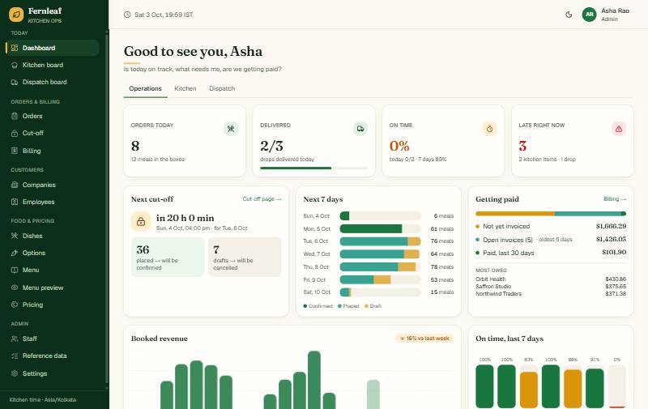
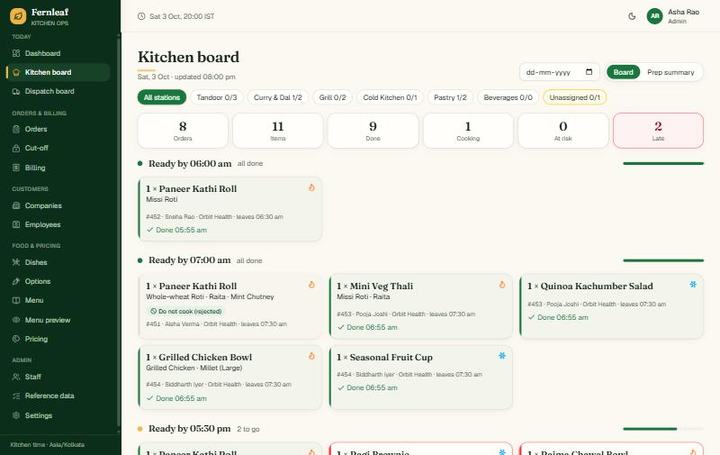
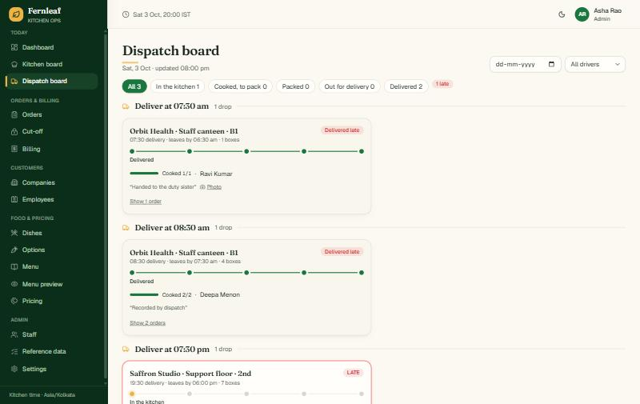
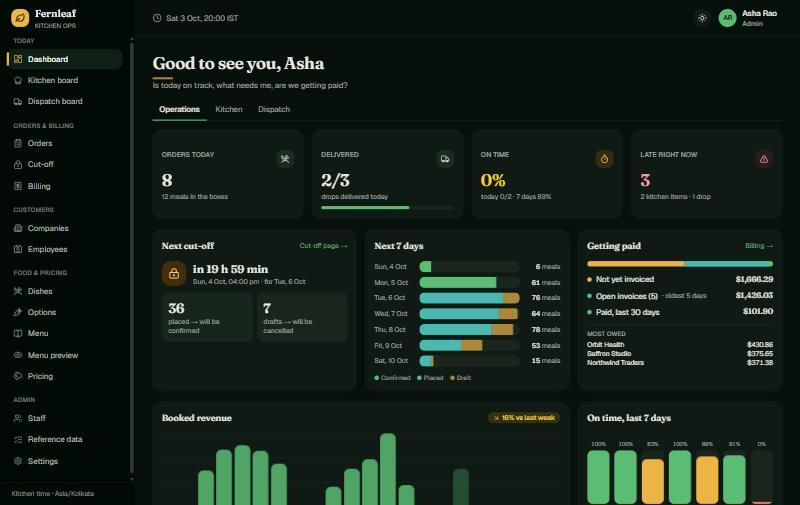
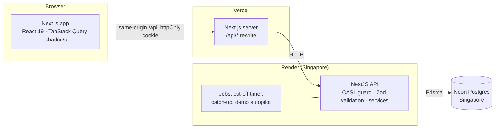
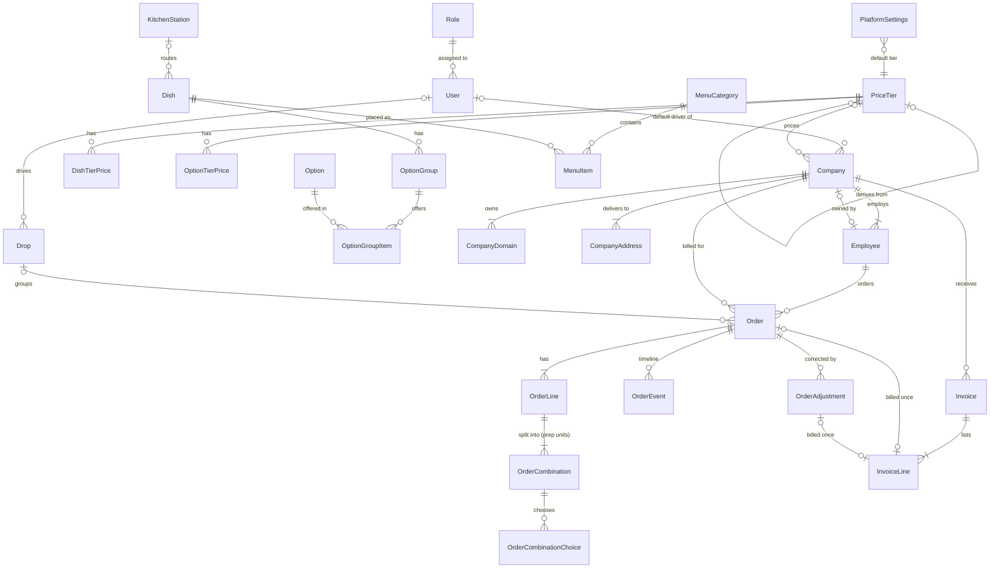

# Fernleaf Kitchen Ops

The internal admin panel for **Fernleaf Kitchen**, a corporate boxed-meal kitchen. Staff take orders for client companies' employees, the kitchen cooks to a per-station board, dispatch sends drops out with drivers, drivers deliver from their phones, and billing invoices every company.

Built for the Heizen engineering assignment with the mandatory stack: **Next.js** (web) · **NestJS** (API) · **Prisma** (ORM) · **Postgres** (Neon).

| | |
|---|---|
| **Live app** | https://kitchen-management-hizen.vercel.app (Vercel) |
| **API health** | https://fernleaf-api-l0yq.onrender.com/api/health (Render, Singapore) |
| **Repository** | this repo |

### Test accounts (password `Test@1234` for all four)

| Role | Email | What they see |
|---|---|---|
| Admin | `admin@test.com` | Everything except the driver's own view |
| Kitchen | `kitchen@test.com` | Kitchen dashboard and board, read-only dishes and orders, **no prices** |
| Dispatch | `dispatch@test.com` | Dispatch dashboard and board, read-only kitchen readiness, companies and orders, **no prices** |
| Driver | `driver@test.com` | Only their own drops for today |

Every account has only its role's access. The server enforces it on every route; the UI simply hides what the server would refuse.

| Admin dashboard | Kitchen board | Dispatch board |
|---|---|---|
|  |  |  |

<details><summary>Dark mode (moon icon, top right)</summary>



</details>

---

## Contents

1. [Five-minute tour](#1-five-minute-tour)
2. [Local setup](#2-local-setup)
3. [Architecture](#3-architecture)
4. [Data model](#4-data-model)
5. [Business rules and where they are enforced](#5-business-rules-and-where-they-are-enforced)
6. [Time, money and billing policy](#6-time-money-and-billing-policy)
7. [Dashboards: what each figure means](#7-dashboards-what-each-figure-means)
8. [Key decisions and trade-offs](#8-key-decisions-and-trade-offs)
9. [Prioritisation: built, skipped, next](#9-prioritisation-built-skipped-next)
10. [Ambiguities and how I read them](#10-ambiguities-and-how-i-read-them)
11. [Testing](#11-testing)
12. [Demo data](#12-demo-data)
13. [How I worked (and the AI note)](#13-how-i-worked-and-the-ai-note)

---

## 1. Five-minute tour

The data is generated around **today**, whichever day you look: two weeks of delivered history, live work today, and open orders for the next week.

| As | Try this |
|---|---|
| **Admin** | **Dashboard**: today's progress, the next cut-off with the drafts it will cancel, the 7-day pipeline, money owed. **Orders → New order**: pick Lumen Labs and an employee, add a bowl, split it into *6 × brown rice + 4 × jeera rice*, watch the server price it live. **Cut-off**: lock times and the run history (**Run now** is safe to repeat). **Pricing**: open *Startup* and tick "Missing only". **Menu preview**: an allergic employee at Lumen Labs, then type `chefs-table`. **Billing**: create an invoice; on a delivered order, **Record shortage**. **Companies → a company**: pick a holiday date that already has orders (the warning lists them), or **Import CSV** with the template. The moon icon (top right) switches to dark mode. |
| **Kitchen** | **Kitchen board**: station chips, items grouped by ready-by time, red LATE and amber AT RISK, **Start / Done**. Click Done on the same item in two tabs: one wins, the other gets a clear conflict message. **Prep summary** for the day's totals. |
| **Dispatch** | **Dispatch board**: drops (company + address + exact time), cooked x/y, driver picker, **Mark packed → Send out**. |
| **Driver** | Open on a phone: **My deliveries** with the next stop first; **Mark delivered** with a note and a camera photo. |

A small autopilot moves the *generated* orders along their plans during the day, so the boards always have work in every state. Touch an order or drop yourself and the autopilot leaves it to you.

---

## 2. Local setup

Requirements: Node 22, pnpm 10 (via `corepack`), a Postgres database (a free Neon project works).

```bash
corepack enable
pnpm install
cp backend/.env.example backend/.env       # set DATABASE_URL, DIRECT_DATABASE_URL, JWT_SECRET (32+ chars)
cp frontend/.env.example frontend/.env     # API_ORIGIN=http://localhost:4000
pnpm --filter @fernleaf/backend db:deploy  # apply migrations (incl. CHECK constraints)
pnpm --filter @fernleaf/backend db:seed    # roles, the 4 accounts, settings, catalogue, tiers, menu, companies, employees
pnpm dev                                   # web on :3000, API on :4000
```

The first API start generates the rolling demo window (about a minute against a remote database). Everyday commands:

| Command | What |
|---|---|
| `pnpm lint` · `pnpm typecheck` · `pnpm test` | Must stay clean (CI runs them on every push, plus `format:check` and `build`) |
| `TZ=America/Los_Angeles pnpm --filter @fernleaf/shared test` | Domain rules give the same answers in any server time zone |
| `pnpm --filter @fernleaf/backend db:seed` | Idempotent: creates what's missing, never overwrites admin edits |

---

## 3. Architecture



**Repository layout** (pnpm workspaces):

```text
shared/    pure business rules (cut-off, pricing, menu, combinations, billing), Zod contracts,
           permission codes and the CASL rules built from them. Used by both apps.
backend/   NestJS 11 API + Prisma 7 (schema, migrations, seed). Owns every transaction.
frontend/  Next.js 16 UI. Talks to the API over HTTP only: no business logic, no database access.
docs/      PRD, TRD, data model and architecture specs written before the code.
vault/     the project's working memory (status, tasks, decisions, bugs, session handoffs).
```

**A request, end to end:** the browser calls `/api/...` on its own origin; Next.js rewrites it to the API (so the session cookie is first-party and `httpOnly`). In the API one global guard reads the session, rebuilds the user's CASL ability from their role's **permission codes**, and checks the route's policy. Every route must declare `@Public`, `@AnyUser` or a policy, or the app refuses to boot. The body is validated with the same Zod schema the UI uses. The service applies the rules from `shared/`, writes in a transaction, and an interceptor strips every `*Cents` field for users without `money.read`. Errors share one envelope `{ error: { code, message, fieldErrors } }`, which the UI maps onto the exact field, line or combination.

**Why this shape:** the rules live once, as pure functions in `shared/`, so the order builder's live quote, the server's validation and the tests all run the same code. Roles are data, so adding a role is a database change, not a code change, and no code ever compares role names (a lint rule forbids it).

---

## 4. Data model

46 tables, 30 CHECK constraints. Overview (full diagrams and the schema: [`docs/DATABASE_MODELS.md`](docs/DATABASE_MODELS.md)):



Modelling choices worth knowing:

* **A combination is the prep unit.** "10 bowls = 6 brown rice + 4 jeera rice" is one order line with two combinations; the kitchen board shows two cards. Identical combinations are merged under a canonical signature.
* **Orders are snapshots.** Lines store the dish name, SKU and the prices captured when each combination was added; choices store option and size names. Renaming or re-pricing the catalogue never changes history, and an unchanged combination keeps its price when an open order is edited.
* **Exactly one default tier** is a required foreign key on the settings row, so "no default" or "two defaults" can't exist.
* **Drops** (company + address + exact delivery instant) are rows created at confirmation with the company's default driver. Dispatch acts on a drop; an order's stage is derived from its own and its drop's timestamps.
* **An order or adjustment is on at most one invoice**, enforced by unique keys on `InvoiceLine`; concurrent invoicing of the same order fails for all but one.
* Dishes, options, addresses and employees are **deactivated, never deleted**, because orders point at them.

---

## 5. Business rules and where they are enforced

Every rule has an ID in [`docs/PRD.md`](docs/PRD.md) §5, a pure function in `shared/src/domain/`, and tests named after it.

| Area | Rule (short) | Where |
|---|---|---|
| Cut-off | An order for date *D* locks at the cut-off time on the *N*th **kitchen working day** before *D* (kitchen holidays skipped; N = 0 means the same day). Wed + N=2 at 16:00 → Mon 16:00. The company calendar never moves it. | `domain/cutoff.ts` · `cutoff.test.ts` |
| Locking vs processing | Locking is computed from the clock. Processing (at the cut-off, on catch-up, or "Run now") cancels drafts and confirms placed orders, under a Postgres advisory lock; a second run changes nothing. | `orders/cutoff.service.ts` |
| Deliverable dates | Company working day, not a company holiday, kitchen working day, not a kitchen holiday, not in the past (IST). | `domain/cutoff.ts` |
| After the cut-off | Non-admins can't create, edit, place or cancel. Admins can add a **late order** (created Confirmed, straight into a drop), cancel/reject, or change time/address/packaging until the drop leaves. Lines of a confirmed order are not edited. | `orders/orders.service.ts` |
| Combinations | Quantities add up to the line; every required group answered; max selections; options only from the dish's groups; portioned groups need a size the option supports; min order quantity. | `domain/combinations.ts` |
| Pricing | No price on the employee's tier → the dish is absent from their menu (never $0). Derived tiers: cost × factor or another tier ± %, rounded **up** to the next 5¢; overrides used exactly as typed; explicit "not sold"; cycles refused. | `domain/pricing.ts`, `domain/menu.ts` |
| Employee flags | Without "may choose address / change time / change packaging", the company default applies and other values are refused. Times must sit on a delivery-window slot. | `orders.service.ts` |
| Allergies | Dishes or options clashing with the employee's allergies are flagged; placing needs an acknowledgement the server checks; the kitchen sees the flag. | `combinations.ts`, kitchen board |
| Kitchen | Only confirmed orders; start once; "done" without start records the start; kitchen-ready only when the last unit is done; concurrent clicks → one success, one 409. | `kitchen/kitchen.service.ts` (row lock + conditional updates) |
| Dispatch | Packed only when every order is cooked; out needs a driver; delivered by the assigned driver (own drops, today) or dispatch; on-time stored once. | `dispatch/dispatch.service.ts` |
| Billing | See §6. | `domain/billing.ts`, `billing/billing.service.ts` |
| Companies | Domains lower-case, unique across companies, never a public provider; employee email on a company domain; owner can't be moved or deactivated until ownership is transferred. | `domain/company.ts`, `companies/*` |

---

## 6. Time, money and billing policy

**Time zone.** The kitchen operates in **Asia/Kolkata (IST)**. Delivery dates are kitchen-local calendar dates (`YYYY-MM-DD`, stored as `date`); instants are stored in UTC. "Today", cut-offs and planned times are always computed in IST from one clock service, never from the server's or browser's local time. The domain tests run under `TZ=UTC`, `America/Los_Angeles` and `Asia/Kolkata` with identical results; production runs the API with `TZ=UTC` on purpose.

**Money.** Every amount is an **integer number of US cents** in fields named `*Cents`; no floats anywhere. Tier factors are basis points (×2.4 = 24 000). Derived prices round up to the next 5¢ with integer arithmetic (88¢ × 2.4 = 211.2¢ → **$2.15**). Unit price = dish + options + size extras; order total = Σ lines; invoice total = Σ lines, asserted when the invoice is written. Dollar inputs are parsed from the string, so "0.29" is exactly 29¢.

**Billing policy for changes after invoicing.** Confirmed and delivered orders are owed in full. Invoices are **immutable**; the only change is Issued → Paid.

| What happens | Effect |
|---|---|
| Cancel or reject an order **before** it's invoiced | It stops being billable; no paperwork |
| Cancel or reject an order **after** it's invoiced | A credit of −(order total) is created in the same transaction and billed on the company's next invoice |
| Short delivery (admin) | Short quantity per combination, never more than ordered; credit = −Σ(short × unit price); an order's credits never exceed its total |
| Time, address, packaging or driver changes | Never affect billing |

---

## 7. Dashboards: what each figure means

Conventions for every figure: IST; grouped by **delivery date**; *active* orders = Confirmed + Delivered (Cancelled and Rejected are excluded); *meals* = Σ combination quantities; money = stored cents, gross before adjustments; a drop counts only if it holds a non-cancelled order; a ratio with nothing to divide by shows **"—"**, never 0 % or 100 %; missing data is shown ("Unassigned" station, "No driver").

### Admin: "Is today on track, what needs me, are we getting paid?"

| Figure | Exact definition | Why |
|---|---|---|
| Orders / meals today | Active orders with delivery date = today / Σ their meals | Size of today's service |
| Delivery progress | Delivered drops ÷ all drops today | Is service on track? |
| On time | Drops delivered on time ÷ drops delivered, today and over the last 7 days | Service quality |
| Late right now | Kitchen units past planned kitchen-ready and not done + drops past planned dispatch-ready and not out | Needs intervention now |
| Next cut-off | Earliest future cut-off, with the drafts it will cancel and the placed orders it will confirm | Chase drafts before they expire |
| Processing pending | Dates whose cut-off passed but still hold Draft/Placed orders (should be empty), with **Run now** | Integrity alarm |
| Next 7 days | Confirmed / Placed / Draft counts and meals per date; kitchen holidays flagged | Capacity and purchasing |
| Booked revenue | Σ active order totals per delivery date, last 14 days and next 7 (Confirmed only for the future); this week so far vs the same days last week | Demand trend |
| Not yet invoiced | Σ billable orders without an invoice line + Σ uninvoiced adjustments; top companies | Cash collection |
| Open invoices / paid | Count and Σ of Issued invoices, age of the oldest; Σ paid in the last 30 days | Chase payments, cash in |
| Setup gaps | Dishes on an active menu item with no price on a tier in use (a company's tier or the default); companies without a default driver; active dishes without a station | Prevents "why can't they see X?" calls |

Not shown: profit or margin (costs are typed by hand and option costs are often missing, so the number would mislead), per-employee spend (privacy, not operational), decorative charts.

### Kitchen: "What do I cook, by when, where are we behind?" (today, tomorrow one click away)

| Figure | Exact definition | Why |
|---|---|---|
| Meals to cook / done | Σ meals over confirmed orders for the date; Σ meals of done units | Load and progress |
| Late / at risk | Units not done with now > planned kitchen-ready / within the warning window (default 30 min) before it | Fix bottlenecks first |
| Production by station | Meals not started / cooking / done per station, including "Unassigned" | Load per station |
| Next deadlines | Next 3 ready-by times ≥ now with outstanding meals per station | Sequence the work |
| Allergen watch | Combinations whose allergens (dish ∪ chosen options) intersect the employee's recorded allergies; meals per allergen | Safety |
| Prep summary | Station → dish → combination → Σ quantity | "Cook 46 paneer bowls, brown rice, large" |
| Tomorrow | Confirmed meals by station; placed meals listed separately while tomorrow's cut-off hasn't passed ("may still change") | Prep planning |

Orders cancelled after work started appear as **Do not cook**. Not shown: prices, billing, customer contact details.

### Dispatch: "What leaves next, who drives it, what's late?"

| Figure | Exact definition | Why |
|---|---|---|
| Drops by stage | Waiting on kitchen (an order not cooked) · Ready to stage (all cooked, not packed) · Dispatch-ready · Out · Delivered | Pipeline at a glance |
| Late / at risk | Drops not out, past / near their planned dispatch-ready (earliest of their orders) | Act before it's late |
| No driver | Drops today and tomorrow with no driver | Assign in time |
| Next departures | Next 5 drops not out, by planned dispatch-ready, with cooked x/y and driver | Order of work |
| Driver load | Per driver today: assigned / out / delivered / on-time | Balance routes |
| On time today | On-time ÷ delivered drops today | Quality |

### Driver: "Where do I go next?"

| Figure | Exact definition |
|---|---|
| My drops today | Drops assigned to me for today; delivered vs remaining |
| Next stop | My earliest not-delivered drop: time, company, address, boxes, instructions |
| On time today | My on-time ÷ my delivered drops today |

---

## 8. Key decisions and trade-offs

Full reasoning in [`vault/05 Decisions/Decision Log.md`](vault/05%20Decisions/Decision%20Log.md).

| ADR | Decision | Trade-off accepted |
|---|---|---|
| 001/022 | `frontend/` + `backend/` + `shared/` with pnpm workspaces (no Turborepo) | Slightly slower builds than a cached task runner; much simpler to understand |
| 002 | Vercel + Render + Neon, all in Singapore | Free tiers sleep; mitigated with a keep-alive and DB-frugal jobs |
| 003 | Same-origin `/api` proxy with an `httpOnly` cookie | One extra hop through Next.js; no CORS, no tokens in JavaScript |
| 004/023 | Roles as data holding permission codes; CASL abilities built from the codes | A small abstraction to learn; roles change without code |
| 005/006 | Integer cents (USD) and one kitchen time zone (IST) | No multi-currency or multi-kitchen yet |
| 007/008 | Pure rules in `shared/`, services own transactions; shared Zod contracts | Two packages to build; one source of truth for UI and server |
| 009/010 | Prices resolved on read; orders capture prices per combination | A little computation per menu view; history never moves |
| 011 | A combination is the prep unit | Kitchen sees distinct cards per variant, not one per meal |
| 012 | Time-based lock + idempotent processing | Locked-but-unprocessed orders can exist briefly; the dashboard alarms on it |
| 013 | One timer for the next cut-off + catch-up instead of polling | Neon's free compute stays well inside budget |
| 014 | Persisted drops, derived order stage | Override moves need rules (implemented) |
| 015 | Immutable invoices + credit adjustments | Credits land on the next invoice, not by editing the old one |
| 016 | Advisory locks, row locks and conditional updates for races | Slightly more SQL; exactly-once behaviour under concurrency |
| 017 | Rolling generated data + autopilot, 7-day kitchen in the seed | Generated data is clearly marked (`source = DEMO`) and resettable |
| 018 | Delivery photos in Postgres (compressed in the browser) | Fine at this scale; object storage later |
| 026 | Tier grid as a plain table over one whole-tier response | Would need pagination past a few hundred items |
| 027 | Combination signature sorted by ids, not display order | Reordering the catalogue can't silently re-price an open order |
| 028 | Warm brand theme through the shadcn tokens, dark mode (next-themes), CSS motion and hand-built charts | No chart library: simpler charts, smaller bundle; every animation is off under "reduce motion" |
| 029 | One Neon branch for local dev and production; bulk test scripts on a throwaway branch | Local clicks change live data, so probes clean up after themselves |
| 030 | Prisma `relationJoins`: nested reads in one SQL query | A preview feature; turned on only after 42 endpoints returned identical JSON both ways |

---

## 9. Prioritisation: built, skipped, next

The brief gives more scope than time. The rule I followed: every **Must** properly (server-side rules, tests, working UI) before any **Should**.

**Built (all Musts):** access and staff (with self-lockout guards and session revocation), settings and kitchen holidays, admin-managed reference lists, catalogue with option groups and portions, four price tiers with a derivation grid, menu with secret categories and per-employee preview, companies and employees with moves and ownership, the order builder with live server validation, cut-off locking and processing, the kitchen board, the dispatch board, the driver's phone view with photos, billing with credits and shortages, four role dashboards, and self-renewing demo data.

**Shoulds built (all of them):** portions, allergy acknowledgement, money hidden from non-admin roles, cut-off preview, company and kitchen holiday conflict warning, employee CSV import with a per-row report, demo autopilot, demo regenerate.

**Skipped, and why:**

| Item | Priority | Why | With more time |
|---|---|---|---|
| Roles editor UI | Could | Roles are already data | Permission checkboxes per role |
| Admin line edits after confirmation | Could | Would desync kitchen units and invoices | Re-plan units + adjustment if already invoiced |
| Invoice void/reissue, exports, payments, notifications | Could / out of scope | Credits cover corrections; email is simulated in the log | Void + reissue with a reason |
| Database race tests in CI | — | CI has no database; the races are checked by `probe:concurrency` on a throwaway Neon branch (§11) | Create a Neon branch per CI run and run the script there |

**Next, with more time:** live board updates (SSE) instead of 15–30 s polling, object storage for photos and dish images, a notifications outbox instead of simulated emails, Playwright end-to-end tests for the reviewer paths, and multi-kitchen support.

---

## 10. Ambiguities and how I read them

The full list (A-01…A-40) is in [`docs/PRD.md`](docs/PRD.md) §10. The ones that shape behaviour most:

| Topic | Interpretation |
|---|---|
| Counting cut-off days | Kitchen working days strictly before the delivery date; N = 0 means the cut-off is on the delivery day (matches the brief's Wed → Mon example) |
| Deliverable dates | Must satisfy **both** calendars; the kitchen can't cook on its own holidays |
| Lock vs processing | Locking is time-based; processing does the status changes, so a stale order can never be edited after its cut-off |
| Orders after the cut-off | Admin "late orders" are created directly as Confirmed; drafts for locked dates aren't allowed, which keeps processing idempotent |
| Admin powers after confirmation | Cancel, reject, change time/address/packaging; **no line edits** (cancel and re-create, or record a shortage) |
| Rejected vs Cancelled | Rejected = the kitchen refuses an order it can't fulfil (with a reason); Cancelled = withdrawn, or a draft expiring at the cut-off. Neither is billable |
| Unpriced dishes | A dish with no price on the employee's tier is absent from their menu; there is no fallback to another tier |
| Employee flags | Addresses come from the company's list, times from delivery-window slots, packaging from active types |
| Moving employees | Needs an email on the new company's domain; owners hand over first; existing orders keep their company, address and prices |
| Weekend service | The seeded kitchen runs 7 days so every review day, weekends included, has live data |
| Excluded vs missing prices | "Missing" counts mean no decision was made; an explicit "not sold" is a decision. Both hide the dish |

---

## 11. Testing

* **336 automated tests** (Vitest): 122 for the pure rules in `shared/`, 214 in the API.
* Business-rule tests are **named after their rule IDs**, for example `BR-CUT-01: Wednesday with N=2 locks Monday 16:00 IST`, `BR-CMB-01: the brief example, 10 bowls = 6 brown + 4 jeera`, `BR-KIT-02`, `BR-DSP-05`, `BR-BIL-07`. Bug fixes carry `BUG-###` regression tests.
* A **permission matrix** boots the real application module and asserts, route by route, which of the four roles get through.
* Domain tests pass under three server time zones (CI runs them under each).
* Behaviour that needs a real database (concurrent invoicing, simultaneous "done" clicks, cut-off re-runs) was verified against Neon during development and is recorded in the phase notes in `vault/02 Phases/`. Two repeatable scripts run the same checks through the real API on a throwaway Neon branch (`backend/.env.perf`; they refuse the live database): `pnpm --filter @fernleaf/backend probe:concurrency` (races + total reconciliation) and `pnpm --filter @fernleaf/backend perf:kitchen` (a 400-order day, board timings).
* **Concurrency, last run 2026-10-03 (9/9 pass):** two simultaneous *Start* and two *Done* clicks on one prep unit → 200 + 409; two simultaneous invoices for one company → 201 + 409 `ALREADY_INVOICED`; the cut-off run fired twice at once handled 6 + 0 orders and a third run 0/0; no company without owner or default address; every combination, line, order and invoice total reconciles.
* **Kitchen board at 400 orders** (the brief's bar). The script filled today to 400 confirmed orders through the API, then timed 30 requests each from a laptop in India through the local API to Neon in Singapore (one database round trip ≈ 71 ms from there). The first run showed the time was mostly sequential round trips, one per relation level, so Prisma's join loading went in (ADR-030):

| Request (400 orders, 568 prep units) | p50 before | p50 after | p95 after |
|---|---|---|---|
| `GET /kitchen/board` | 1525 ms | **584 ms** | 773 ms |
| `GET /kitchen/board?stationId` | 1450 ms | 548 ms | 630 ms |
| `GET /dispatch/board` | 706 ms | 381 ms | 454 ms |
| `GET /dashboard/admin` | 2308 ms | 1160 ms | 1395 ms |
| `GET /orders` (page 1) | 418 ms | 216 ms | 323 ms |

  On Render the API sits in the same region as Neon (round trip 3–37 ms), so production is faster than these laptop numbers.

---

## 12. Demo data

* **Static seed** (`db:seed`, idempotent): roles, the 4 accounts plus extra drivers and a cook, settings, reference lists, 27 dishes and 17 options with groups, 4 price tiers, 7 menu categories plus the secret `chefs-table`, 5 companies (Mon–Fri, Tue–Thu and 7-day calendars, different tiers, hidden items, holidays) and 60 employees with allergies and preferences. Domains use the reserved `.example` TLD.
* **Rolling window**, generated by the API on startup and kept current: for every date from today −14 to today +7, orders are built through the **same** menu, combination and pricing functions as real ones. Past days are delivered (with a few cancellations and rejections), today is confirmed and live, the next days are placed or draft until their cut-off. Weekly invoices cover delivered orders older than a week (older ones paid, the latest issued).
* **Autopilot**: generated orders for today advance along their own plan (cooking, packing, out, delivered) up to a per-drop limit, so at any hour some work is left for each role and `driver@test.com` has drops. Any human action takes that order or drop over.
* **Settings → Demo data → Regenerate** resets only generated data; anything staff created stays.

---

## 13. How I worked (and the AI note)

I planned before coding: the specs in `docs/` (requirements with IDs, technical design, data model, architecture) came first, and the build followed them phase by phase (P0–P11), then a last phase (P12) for polish and proof: the UI redesign, the remaining Shoulds, and repeatable perf and concurrency scripts. Deviations are recorded as ADRs and reflected back into the docs. The `vault/` folder is an Obsidian vault that holds the live state: task board, phase logs, requirements matrix, bug tracker, decision log, commit log and session handoffs, so any person or agent can pick the project up mid-way.

I used an AI coding assistant (Claude) throughout, for drafting specs, writing code and tests, and probing the running app. I reviewed every change, ran the checks (lint, types, tests, build, CI) on each commit, and verified behaviour against the real database and in the browser. I can explain any line in this repository.
