# Fernleaf Kitchen Ops — Architecture

| | |
|---|---|
| **Version** | 1.1 (2026-10-03): `frontend/` + `backend/` + `shared/` layout (ADR-022), CASL authorisation (ADR-023). 1.0 was the planning baseline |
| **Audience** | Reviewers, future maintainers, any agent picking up the project |
| **Companion docs** | [PRD](./PRD.md) · [TRD](./TRD.md) · [Database models](./DATABASE_MODELS.md) · ADR details: `vault/05 Decisions/Decision Log.md` |

---

## 1. Architecture at a glance

Fernleaf Kitchen Ops is a **three-tier web application**:

* a **Next.js** single-page-style admin UI;
* a **NestJS** REST API that owns *all* business rules;
* a **PostgreSQL** database accessed through **Prisma**.

Both apps live in **one repository** (`frontend/`, `backend/`, `shared/`, linked as pnpm workspaces) and share a package of **contracts** (Zod schemas, types), **permission codes + CASL rules** and **pure business-rule functions**.

Design priorities, in order:

1. **Correctness of rules, money and time.** Rules live in pure, tested functions, and the database enforces what it can.
2. **Server-side authority.** The UI only renders and collects input. The API validates, authorises and decides.
3. **Operability on free tiers.** The app is live for weeks with fresh data, no babysitting, and no wasted DB compute.
4. **Changeability.** New roles, tiers or rules are data or isolated function changes, not a hunt through the codebase.

---

## 2. System context

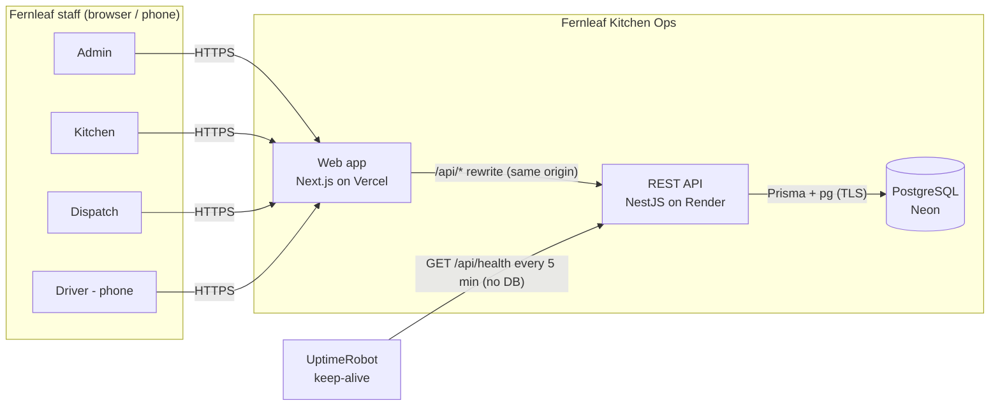

* Employees (the customers) **never** use the system directly (no customer app, by brief). Staff order on their behalf.
* There are no external integrations: no payments, accounting or email. Email-worthy events are written to the API log.

---

## 3. Deployment view

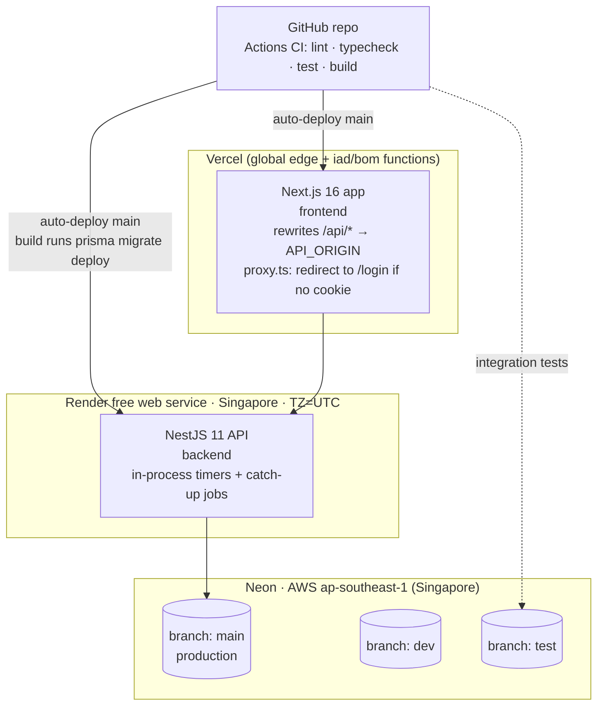

> **As built (ADR-029):** a single Neon branch serves local dev and production; `dev`/`test` were never created. CI runs unit and service tests without a database. Bulk test scripts use a throwaway branch.

| Concern | Choice | Notes |
|---|---|---|
| Latency | API and DB both in Singapore (≈ 60–80 ms from India); Vercel edge proxies `/api` | Same-region API↔DB keeps queries fast |
| Availability | UptimeRobot pings `/api/health` every 5 min, so Render never sleeps (744 h/month < 750 free) | `/api/health` doesn't touch the DB, so Neon can still scale to zero |
| DB compute budget | Neon free 100 CU-h/month at 0.25 CU (~400 awake hours) | Jobs use timers and request catch-up, never per-minute polling (TRD §5.10) |
| Server time zone | `TZ=UTC` on Render, deliberately | Demonstrates that kitchen-time logic doesn't depend on the host TZ |

---

## 4. Code structure (containers and packages)

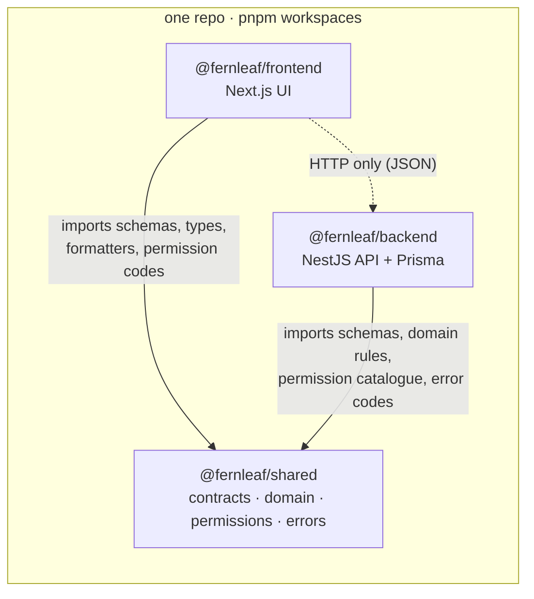

**Rules of the road**

| Rule | Reason |
|---|---|
| `shared` has no I/O, no framework imports, and never reads the clock (`now` is a parameter) | Deterministic, trivially testable business rules usable on both sides |
| `frontend/` never imports from `backend/`, and `backend/` never imports from `frontend/` | HTTP is the only coupling between apps (brief) |
| Business decisions happen **only** in API services and shared domain functions | The UI may pre-validate for UX but is never authoritative |
| One Zod schema per request contract, used by the RHF form *and* the Nest pipe | No drift between client and server validation |
| Money fields always end in `Cents`; dates are `YYYY-MM-DD`; instants are ISO UTC | Conventions that let infrastructure (money redaction, formatters) work generically |

---

## 5. Backend architecture (NestJS)

### 5.1 Module dependency graph

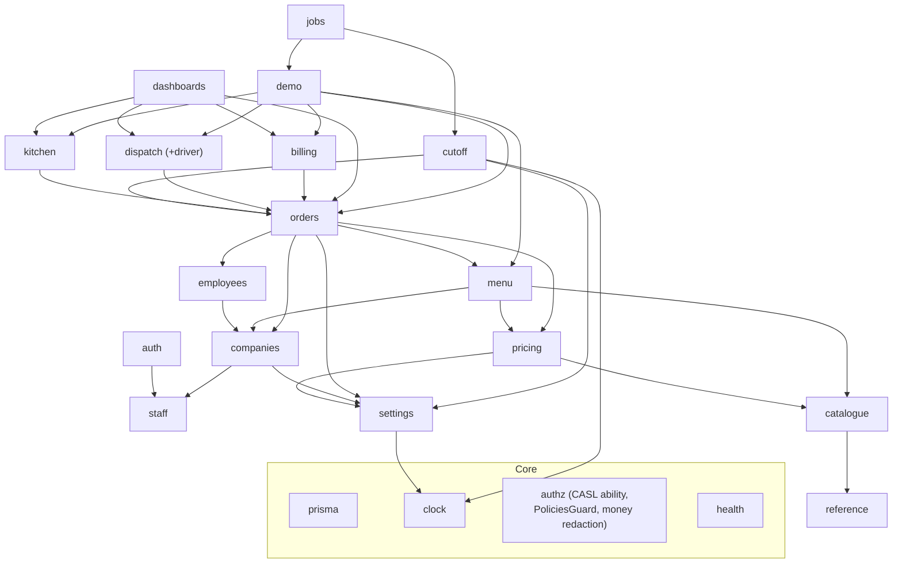

All modules depend on `prisma`, `clock` and `authz`; those edges are omitted for clarity.

### 5.2 Layers inside a module

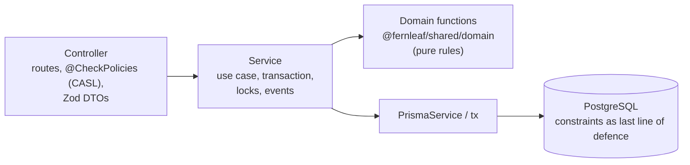

Defence in depth for every rule:

1. Zod shape validation.
2. A pure domain rule (unit-tested).
3. Transactional enforcement (locks and conditional updates).
4. A DB constraint where expressible: unique, CHECK, FK.

### 5.3 Request pipeline

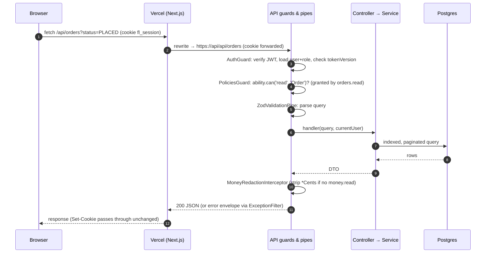

### 5.4 Access control model

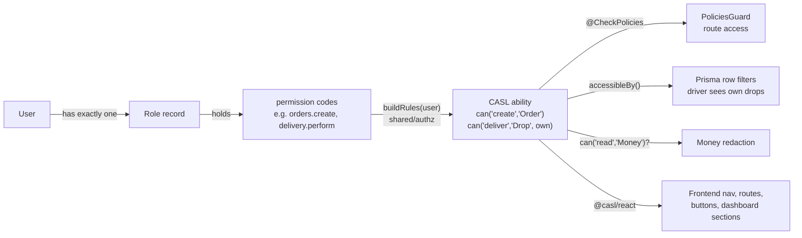

* **No code compares role names.** Codes become CASL rules in one place (`shared/src/authz/rules.ts`), and the frontend and backend use the same rules. Adding a role is an insert of a `Role` with codes (FR-ACC-04).
* **Fail-closed:** a route without `@CheckPolicies` or `@Public()` stops the app from booting.
* **Row-level scoping:** ownership comes from CASL conditions (`accessibleBy`). Business scoping ("today only") is added by the service.
* **Abilities never encode business state.** "Only Confirmed orders can be cooked" stays in domain rules, not in CASL conditions.

---

## 6. Frontend architecture (Next.js)

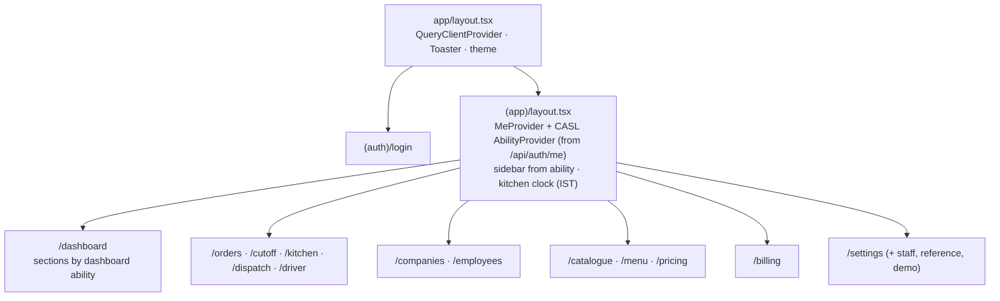

* **Data flow:** components → feature hooks (`useKitchenBoard(date, station)`) → TanStack Query → `apiClient` → `/api/*`.
* **State:** server state lives in TanStack Query. URL state (filters, dates, tabs) lives in search params. Local UI state lives in components. There is no global client store.
* **Authority:** prices, locks, stages, lateness and permissions come from the API. The client only formats them, using shared formatters with the kitchen TZ from `/api/meta/clock`.
* **`proxy.ts`** (Next 16) does a cheap cookie-presence redirect only. The API is the real gate.
* **Responsive:** desktop-first for admin, kitchen and dispatch (kitchen on a wall tablet works); phone-first for `/driver`.

---

## 7. Key runtime flows

### 7.1 Create an order (quote → place)

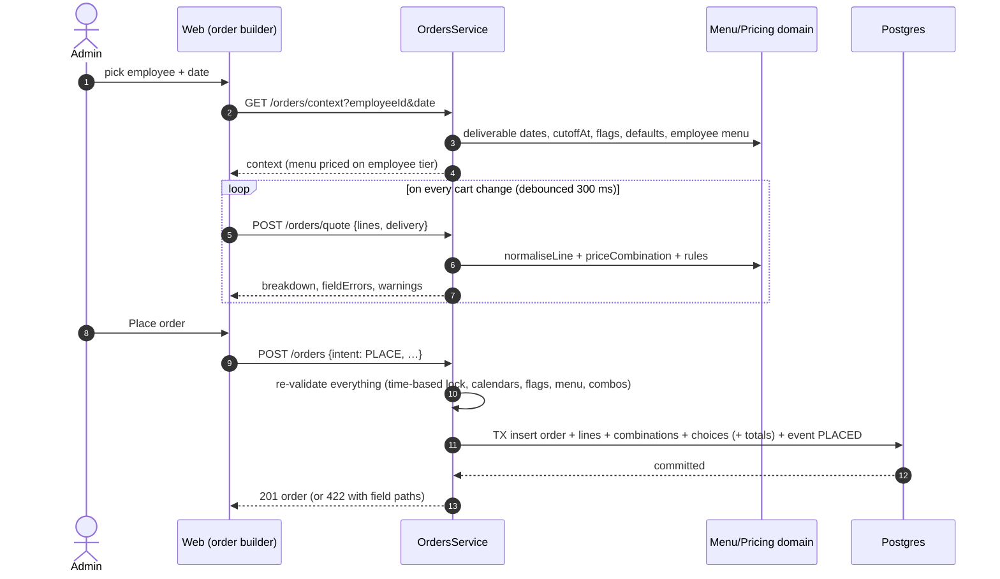

### 7.2 Cut-off: automatic, catch-up, manual

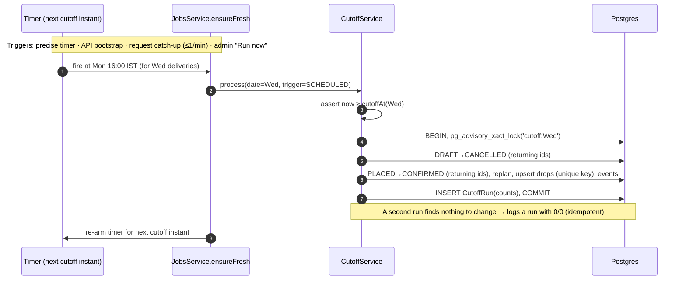

### 7.3 Two cooks press "Done" on the same unit

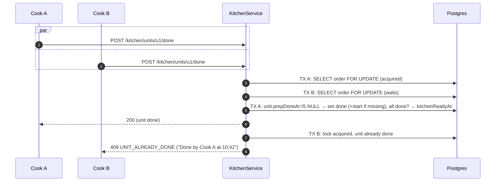

### 7.4 Dispatch and delivery of a drop

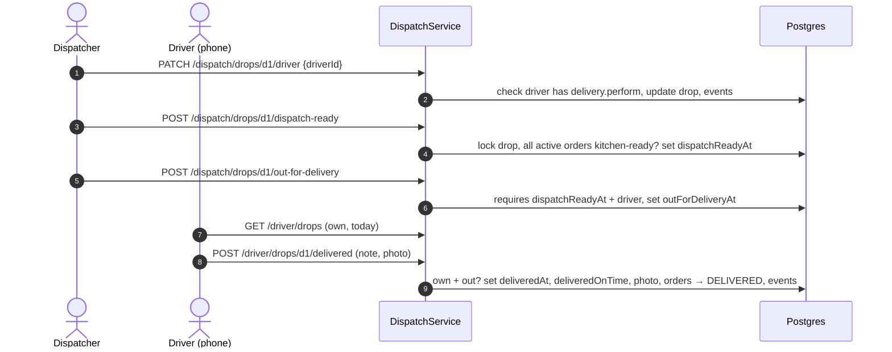

### 7.5 Invoice a company

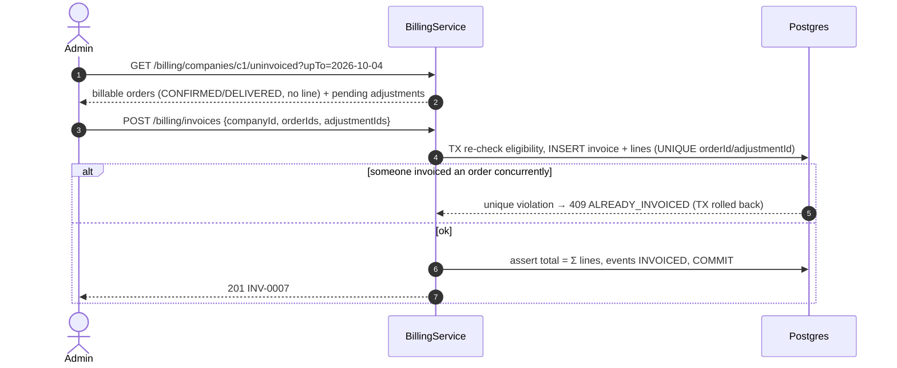

---

## 8. Time and scheduling architecture

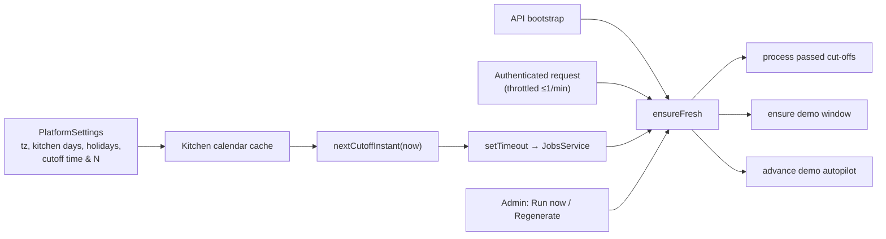

* **The lock is a pure function of time** (`now ≥ cutoffAt(date)`), so even if a job is late no one can edit a locked order. Jobs only move statuses.
* All jobs are **idempotent**, and the jobs that write are **serialised** (advisory locks), so overlapping triggers are harmless.
* **No polling loop touches the DB.** When nobody uses the app and no cut-off is due, the DB sleeps.

---

## 9. Data architecture

* Full model, ERDs, schema and constraints: [DATABASE_MODELS.md](./DATABASE_MODELS.md).
* **Table ownership** (only the owning module writes to it):

| Module | Owns |
|---|---|
| staff/auth | `User`, `Role` |
| settings | `PlatformSettings`, `KitchenHoliday`, `PublicEmailDomain` |
| reference | `Allergen`, `DietaryTag`, `KitchenStation`, `PortionSize`, `PackagingType` |
| catalogue | `Dish*`, `Option*`, `OptionGroup*`, `OptionPortionPrice` |
| pricing | `PriceTier`, `DishTierPrice`, `OptionTierPrice` |
| menu | `MenuCategory`, `MenuItem`, `CompanyHidden*` |
| companies | `Company`, `CompanyDomain`, `CompanyAddress`, `CompanyHoliday` |
| employees | `Employee`, `EmployeeAllergy`, `EmployeeDietaryPreference` |
| orders | `Order`, `OrderLine`, `OrderCombination`, `OrderCombinationChoice`, `OrderEvent` |
| cutoff | `CutoffRun` (+ status transitions through OrdersService) |
| kitchen | prep fields on `OrderCombination`, kitchen fields on `Order` (through OrdersService helpers) |
| dispatch | `Drop`, `DeliveryPhoto` |
| billing | `Invoice`, `InvoiceLine`, `OrderAdjustment` |
| demo | `DemoDay` (creates data only through other modules' services) |

* **History is immutable by construction:** order rows snapshot names, prices and addresses; invoices freeze amounts; corrections are new rows (adjustments, events).

---

## 10. Architecture decisions (summary)

Full context, alternatives and consequences for each decision are in `vault/05 Decisions/Decision Log.md`.

| ADR | Decision | Main alternative rejected | Why |
|---|---|---|---|
| ADR-001 → ADR-022 | **One repo: `frontend/` + `backend/` + `shared/`** (pnpm workspaces, no Turborepo) | Two repos; independent folders without a shared package; `apps/` + Turborepo | Shared contracts and rules with no drift; one history to read; the owner's preferred folder names; one less tool |
| ADR-002 | **Vercel + Render (Singapore) + Neon (Singapore)** + keep-alive | Railway (paid), all-on-Vercel (no long-running jobs) | Free, close to IST, long-running process for timers |
| ADR-003 | **Same-origin `/api` proxy** via Next rewrites + **httpOnly cookie JWT** | Bearer token in localStorage; NextAuth | First-party cookie, no CORS, no XSS-readable token; auth stays in NestJS |
| ADR-004 → ADR-023 | **Roles are data (permission codes) → CASL abilities**: `PoliciesGuard` (fail-closed), `accessibleBy` row filters, money redaction, `<Can>` on the frontend | `@Roles('admin')` checks; hand-written guards only | "Add a role without hunting for role names"; owner knows CASL; row rules in one place |
| ADR-005 | **Integer cents; basis-point factors; integer ceil-to-5¢** | Decimal.js / floats | Exact, simple, fast; reconciliation is provable |
| ADR-006 | **Single kitchen TZ (Asia/Kolkata); DATE for local days; timestamptz instants; server-side "today"; USD currency** (as in the brief) | Browser-local dates | Correct regardless of server/browser TZ; reviewers are in IST |
| ADR-007 | **Pure domain functions in shared; services own TX** | Logic in services/entities | Testable rules; reusable by UI for previews |
| ADR-008 | **Zod contracts shared** (nestjs-zod) + **one error envelope with codes** | class-validator DTOs | Single source of validation truth; actionable errors |
| ADR-009 | **Prices resolved on read**; explicit/override/exclusion rows; default tier = settings FK | Materialised derived prices | Always consistent; no recompute jobs; DB-guaranteed single default |
| ADR-010 | **Snapshot + per-combination price capture**; edits keep captured prices | Price-history tables | Meets "past orders never change" with minimal machinery |
| ADR-011 | **Combination = prep unit**, canonical signature + unique constraint | Separate prep-unit table | Matches the brief's definition 1:1; no sync problems |
| ADR-012 | **Time-based lock + idempotent cut-off processing** (advisory lock, conditional updates, run log) | Status-based lock only | No window for stale edits; safe re-runs; visible history |
| ADR-013 | **DB-frugal scheduling** (timers + catch-up, DB-free health) | Cron polling every minute | Neon free compute budget (100 CU-h/month) |
| ADR-014 | **Persisted drops** with a unique natural key; dispatch per drop; derived order stage | Computed-only groupings | One driver/proof/on-time per drop; concurrency-safe upsert |
| ADR-015 | **Immutable invoices**, DB-unique invoice lines, **adjustments** for post-invoice changes | Editable invoices; void & reissue | Auditability; totals always reconcile; standard credit-note practice |
| ADR-016 | **Concurrency**: optimistic `version` for edits, row locks for kitchen/drops, conditional transitions | Serializable isolation everywhere | Precise, cheap, clear error per race |
| ADR-017 | **Rolling idempotent demo window + autopilot caps; 7-day kitchen in seed** | One-off static seed | "Today" is whatever day reviewers come |
| ADR-018 | **Delivery photos in Postgres** (client-compressed) | S3/Cloudinary | No extra service or secrets; fine at demo scale |
| ADR-019 | **shadcn/ui + Tailwind + TanStack Query/Table + RHF** | Ant Design / Mantine | Owned components, flexible data grids, owner's preference |
| ADR-020 | **Vitest everywhere; domain tests in a TZ matrix** | Jest (Nest default) | One fast runner; proves TZ independence |
| ADR-021 | **Docs = spec, vault = state**; vault committed | Wiki outside repo | Any agent or human can resume from the repo alone |
| ADR-024 → ADR-027 | Version pins; shadcn on Base UI; tier grid as a plain table; combination signature sorted by ids | — | See `vault/05 Decisions/Decision Log.md` |
| ADR-028 | **Warm brand theme through shadcn tokens, dark mode via next-themes, CSS motion utilities, hand-built charts** | Chart library; neutral defaults | Every screen inherits the look; small bundle; reduced-motion safe |
| ADR-029 | **One Neon branch for local dev and production (as provisioned)**; bulk test scripts on a throwaway branch; service tests with a fake Prisma | Separate `dev`/`test` branches | Matches what exists; switching databases a day before submission risks the live app |

---

## 11. Quality attributes: how the architecture delivers them

| Attribute (brief §7) | Mechanism |
|---|---|
| Money correctness | Integer cents, a single pricing module, DB CHECK `total = unit × qty`, invoice total assertion, reconciliation tests |
| Time zones | Kitchen TZ in settings, DATE vs timestamptz split, `ClockService`, TZ-matrix tests, server `TZ=UTC` |
| Concurrency | Optimistic versions, row locks, advisory locks, unique constraints, conditional transitions; each race returns an explicit 409 |
| Validation | Zod (shape) → domain (rules) → TX (state) → DB (constraints); a single error envelope with field paths |
| Performance | Server pagination, indexes matched to queries, a single-query kitchen board, client memoisation, a measured perf script |
| Code quality | Module boundaries with table ownership, a shared contracts package, consistent errors, CI gate (lint, typecheck, test, build) |
| Security | Server-side permissions (fail-closed), cookie hardening, Origin check, throttled login, money redaction, row scoping |
| Operability | Health and readiness endpoints, keep-alive, idempotent self-healing jobs, run logs, simulated-email logs |

---

## 12. Extension points (how it absorbs the next requirement)

| Next requirement | Where it plugs in |
|---|---|
| New staff role | Insert a `Role` with permission codes (or the roles UI, a [Could]). No code change |
| Customer self-service app | Reuses `/orders/context`, `/orders/quote` and `POST /orders`; add employee auth plus a scoping rule "employee = self" |
| Notifications | Replace the `[email-simulated]` logger with a `NotificationsModule` (outbox table + worker) |
| Multiple kitchens | Introduce `Kitchen`; settings, holidays, stations and orders gain `kitchenId`; the calendar cache becomes per kitchen |
| Tier-specific portion prices | Add an optional `tierId` to `OptionPortionPrice`; the resolver gains one lookup |
| Exports | Read models from snapshots; no joins to mutable catalogue data are needed |
| Real-time boards | Swap polling for SSE from the same services; mutation code unchanged |
