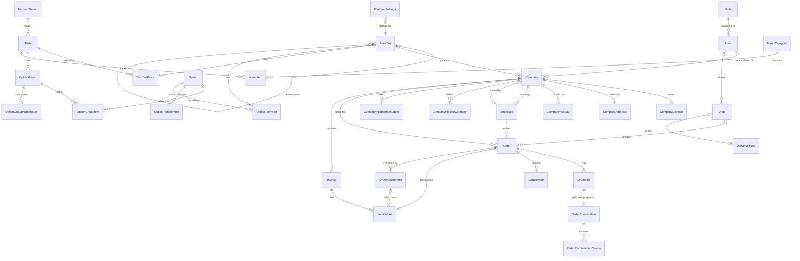
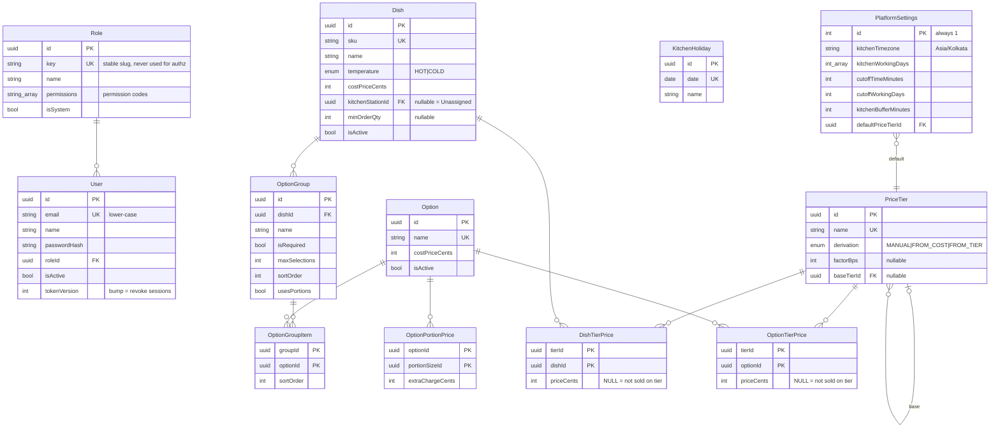
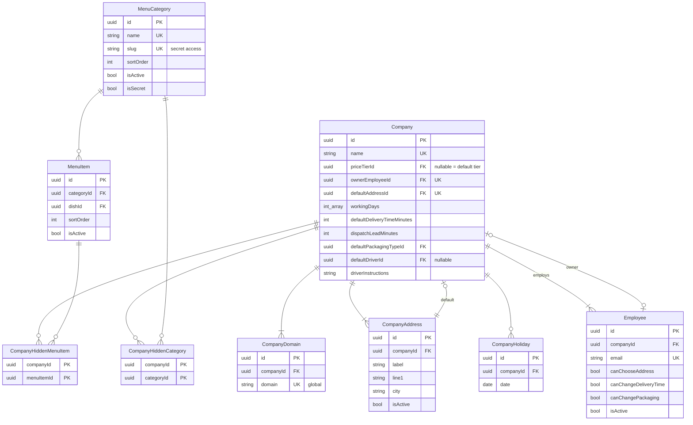
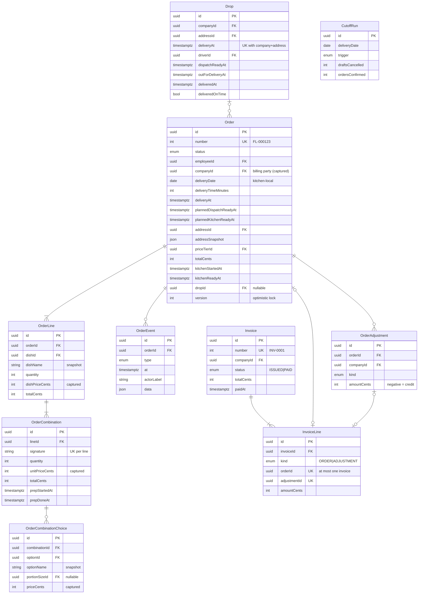

# Fernleaf Kitchen Ops — Database Models

| | |
|---|---|
| **Database** | PostgreSQL 17 on Neon (region `aws-ap-southeast-1`, Singapore) |
| **ORM** | Prisma 7 (`prisma-client` generator, `@prisma/adapter-pg`, `prisma.config.ts`) |
| **Version** | Draft v1, planning baseline (2026-10-03). Validated with `prisma validate` in phase P1; changes are logged in `vault/05 Decisions/Decision Log.md` |
| **Companion docs** | [PRD](./PRD.md) (rules BR-*, interpretations A-*) · [TRD](./TRD.md) · [Architecture](./ARCHITECTURE.md) |

> The data model is one of the main things evaluated. It's designed so that (1) the business rules in PRD §5 are **enforced as close to the data as possible**, (2) history (orders, invoices) **never changes when the catalogue or prices change**, and (3) likely next requirements (new roles, new tiers, multi-select options, more kitchens) fit without a redesign.

---

## 1. Conventions

| Topic | Convention | Why |
|---|---|---|
| Primary keys | `uuid` v7 (`@default(uuid(7)) @db.Uuid`) | Time-ordered (index-friendly) and safe to expose in URLs. Human numbers (`FL-000123`, `INV-0001`) are separate columns |
| Money | `Int` **cents** in columns named `*Cents` | No floating point anywhere (NFR-01). A JS `number` holds integers exactly up to 2^53 |
| Percent / multipliers | `Int` **basis points** (`factorBps`, 10000 = ×1.0) | Integer math: ×2.4 = 24000; +15% = 11500; −10% = 9000 |
| Kitchen-local calendar dates | `DateTime @db.Date` (Postgres `date`) | A delivery date is a calendar day in the kitchen's time zone, not an instant. Helper: `toDbDate('2026-10-05')` ↔ `fromDbDate()` (TRD §7.2) |
| Instants | `DateTime` (Postgres `timestamptz`, stored as UTC) | `deliveryAt`, `cutoffAt`, every `*At` |
| Local time of day | `Int` minutes after midnight (`deliveryTimeMinutes = 750` → 12:30) | Unambiguous and easy to compare and validate on slots |
| Weekdays | `Int[]` of ISO weekdays (1 = Mon … 7 = Sun) | Matches the `date-fns` ISO helpers |
| Snapshots | `*Name`, `*Sku`, `*PriceCents`, `addressSnapshot` copied onto order rows | Editing the catalogue, addresses or prices never rewrites history (BR-PRC-07) |
| Soft delete | `isActive` (deactivate) for anything history references | Dishes, options, companies, employees, staff, addresses, reference data |
| Actor columns | `*ById` as plain uuid columns (**no FK**) | Informational. Staff can be deactivated without touching history |
| Naming | Prisma models in PascalCase singular; columns in camelCase (Prisma default quoting) | Consistent with generated client types |
| Enum vs table | Fixed workflow states are **enums** (statuses, triggers). Business-managed lists are **tables** (allergens, stations, sizes, packaging, tiers, roles) | Admins can manage lists without a deploy (FR-SET-03). Workflow states are code-coupled by nature |

---

## 2. Entity-relationship diagrams

### 2.1 Overview (entities only)



### 2.2 Access, settings, reference data, catalogue and pricing



Not drawn (simple lookups): `Allergen`, `DietaryTag`, `KitchenStation`, `PortionSize`, `PackagingType`, `PublicEmailDomain`, and the join tables `DishAllergen`, `DishDietaryTag`, `OptionAllergen`, `OptionDietaryTag`, `OptionGroupPortionSize`, `EmployeeAllergy`, `EmployeeDietaryPreference`.

### 2.3 Menu, companies and employees



### 2.4 Orders, fulfilment and billing



---

## 3. Entity catalogue

### 3.1 Access

| Model | Purpose | Key rules |
|---|---|---|
| **Role** | Named set of permission codes (`permissions text[]`). Seeded system roles: `admin`, `kitchen`, `dispatch`, `driver` | Codes are validated against the code-defined catalogue in `@fernleaf/shared/permissions` on every write. `key` is for seeding and display only. **Authorisation never compares role keys**: CASL abilities are built from these codes (BR-ACC-01, ADR-023) |
| **User** | Staff account (signs in) | Email unique and lower-case. Password hashed (bcrypt). `isActive=false` blocks login. `tokenVersion` is embedded in the JWT and bumped on deactivation, role change or password reset to revoke sessions (BR-ACC-02) |

### 3.2 Settings and reference data

| Model | Purpose | Key rules |
|---|---|---|
| **PlatformSettings** | Singleton (`id = 1`, CHECK) holding every platform-wide value: kitchen TZ, working days, cut-off time and day count, kitchen buffer (30), at-risk window, on-time grace, delivery window and slot size, default dispatch lead for new companies, **default price tier**, auto-cut-off and demo-autopilot toggles | `defaultPriceTierId` is a required FK, so **exactly one default tier exists by construction** (BR-PRC-06). The time zone is read-only in the UI |
| **KitchenHoliday** | Dates the kitchen is closed | Unique per date. Skipped when counting cut-off days. Not deliverable (BR-CAL-01) |
| **PublicEmailDomain** | Blocklist of public mail providers | Companies can't claim these domains (BR-CMP-01) |
| **Allergen, DietaryTag, KitchenStation, PortionSize, PackagingType** | Admin-managed lists | Unique names, `sortOrder`, `isActive`. Entries in use are deactivated, not deleted |

### 3.3 Catalogue

| Model | Purpose | Key rules |
|---|---|---|
| **Dish** | Sellable item | `sku` unique. `costPriceCents ≥ 0`. `minOrderQty` NULL or ≥ 1. `kitchenStationId` NULL routes to "Unassigned". **Never hard-deleted** (FR-CAT-02) |
| **DishAllergen / DishDietaryTag** | M:N joins | Composite PK |
| **Option** | Reusable choice (paneer, jeera rice…) | Unique name, cost, allergens and tags. Never hard-deleted |
| **OptionGroup** | A dish's question ("Choose your protein") | Belongs to one dish (A-05). `isRequired`; `maxSelections ≥ 1` (default 1, A-06); `sortOrder`; `usesPortions`. Unique `(dishId, name)`. May be deleted, since history keeps names via snapshots and `OrderCombinationChoice.optionGroupId` becomes NULL |
| **OptionGroupItem** | Which options a group offers, in order | PK `(groupId, optionId)` with `sortOrder` |
| **OptionGroupPortionSize** | Sizes a portioned group sells | Only meaningful when `usesPortions = true` |
| **OptionPortionPrice** | That an option supports a size, and the extra charge | `extraChargeCents ≥ 0`. Invariant: every option of a portioned group has a row for **each** of the group's sizes. This is checked by the service on group/option/size changes (FR-CAT-05) |

### 3.4 Pricing

| Model | Purpose | Key rules |
|---|---|---|
| **PriceTier** | Named tier with a derivation rule | `MANUAL` (no factor or base) · `FROM_COST` (factor) · `FROM_TIER` (factor + base tier ≠ self). The shape is enforced by a CHECK. Chains must be acyclic, validated in the service by walking `baseTierId` (BR-PRC-05) |
| **DishTierPrice** | An explicit dish price on a tier: a full price on MANUAL tiers, an **override** on derived tiers | `priceCents` NULL means **explicitly not sold on this tier**, otherwise > 0 (CHECK). Absence of a row means "derive (or missing on MANUAL)" |
| **OptionTierPrice** | The same for options | `priceCents` NULL = not sold, otherwise ≥ 0 |

**Resolution is computed, never materialised** (BR-PRC-02, TRD §8.2). A derived price is always consistent with its base and needs no recompute jobs. The tier grid shows explicit, derived and effective values side by side.

### 3.5 Menu

| Model | Purpose | Key rules |
|---|---|---|
| **MenuCategory** | Group shown to employees ("Bowls") | Unique `name` and `slug`. `sortOrder`, `isActive`, `isSecret` (unlisted but reachable by slug, A-11) |
| **MenuItem** | Placement of a dish in a category | Unique `(categoryId, dishId)`. `sortOrder`, `isActive`. A dish can have several placements |
| **CompanyHiddenCategory / CompanyHiddenMenuItem** | Per-company hiding | Composite PKs. Hiding beats secret (A-10) |

Orders reference **dishes**, not menu items, so menu restructuring never affects history.

### 3.6 Companies and employees

| Model | Purpose | Key rules |
|---|---|---|
| **Company** | Client | Unique name. `priceTierId` NULL means the default tier. `ownerEmployeeId` is **unique** (one company per owner) and must be an employee of this company (service check, BR-CMP-02). `defaultAddressId` is **unique** and must belong to the company, so there is exactly one default address by construction. `workingDays` defaults to `[1..5]`. Delivery defaults: `defaultDeliveryTimeMinutes`, `dispatchLeadMinutes` (60), `defaultPackagingTypeId` (required), `driverInstructions`, `defaultDriverId` (staff user with `delivery.perform`, BR-CMP-03) |
| **CompanyDomain** | Email domains | **`domain` globally unique** (BR-CMP-01). Lower-case. Not in `PublicEmailDomain` (service check) |
| **CompanyAddress** | Delivery addresses | Archived (`isActive=false`), never deleted, because orders and drops reference them. Unique `(companyId, label)` |
| **CompanyHoliday** | Company closures | Unique `(companyId, date)`. Blocks deliveries. Never moves the cut-off (BR-CUT-02) |
| **Employee** | Customer (no login) | Exactly one company. Email globally unique, domain ∈ company domains (BR-EMP-01). Permission flags. Allergies and dietary preferences through joins. Owner can't be moved (BR-EMP-02) |

`ownerEmployeeId` and `defaultAddressId` are **nullable only inside the creating transaction**. The service creates company → owner employee + addresses → sets both FKs in one transaction, and the API never returns a company without them. A NOT NULL can't be expressed because of the creation cycle; a seed/integrity test asserts it.

### 3.7 Orders

| Model | Purpose | Key rules |
|---|---|---|
| **Order** | One employee's order for one delivery date | `number` is a human sequence. `companyId` is **captured** at creation (billing party, A-40). Delivery is stored three ways: `deliveryDate` (kitchen-local DATE, for grouping), `deliveryTimeMinutes` (editing/display) and `deliveryAt` (instant, for comparisons). The service keeps them consistent. Planned times are stored (BR-PLN-03). Address, packaging and tier are captured as FK + snapshot. `totalCents = Σ lines` is maintained in the same transaction (BR-MNY-02). Kitchen actuals: `kitchenStartedAt`, `kitchenReadyAt`. `dropId` is set at confirmation. `version` supports optimistic concurrency on edits. `source` is STAFF or DEMO. `demoAutopilotUntil` is demo only |
| **OrderLine** | One dish in the order | Unique `(orderId, dishId)` (A-08). Snapshots `dishName`, `dishSku` and `dishPriceCents` (captured). `quantity = Σ combination qty`; `totalCents = Σ combination totals` |
| **OrderCombination** | A distinct set of choices with a quantity. **This is the kitchen prep unit** (FR-KIT-01) | Unique `(lineId, signature)` keeps combinations distinct (BR-CMB-04). `unitPriceCents` is captured. `totalCents = unit × qty` (CHECK). Prep state: `prepStartedAt/ById`, `prepDoneAt/ById`. CHECK: done implies started |
| **OrderCombinationChoice** | One chosen option (and size) | FK to `Option` (never deleted). `optionGroupId` SetNull on group removal. Snapshots group, option and size names plus `priceCents` (option tier price + portion extra, captured) |
| **OrderEvent** | Order timeline | `type`, `at`, `actorId` (informational), `actorLabel` ("Asha Rao · Admin", "System · cut-off", "Demo autopilot"), `data` JSON (before/after values). Not a general audit log (out of scope) |
| **CutoffRun** | Log of cut-off processing runs | One row per run, including no-op re-runs, which makes idempotency visible. Counts of cancelled drafts and confirmed orders. `trigger` = SCHEDULED, CATCH_UP or MANUAL |

### 3.8 Fulfilment

| Model | Purpose | Key rules |
|---|---|---|
| **Drop** | Orders for the same company + address + **exact** delivery instant, handled together (FR-DSP-02) | **Unique `(companyId, addressId, deliveryAt)`**, so concurrent confirmations upsert the same drop. Driver (FK to User). Dispatch stage timestamps live on the drop. CHECKs: out-for-delivery requires dispatch-ready and a driver; delivered requires out-for-delivery. `deliveredOnTime` is stored at delivery (BR-DSP-05) |
| **DeliveryPhoto** | Optional proof-of-delivery photo | 1:1 with Drop. `bytea` ≤ 1 MB (client-compressed JPEG/WebP). Served only to authorised users |

The **order's fulfilment stage is derived**: kitchen timestamps come from the order, and dispatch timestamps come from its drop (PRD §6.2). Delivery also sets `Order.status = DELIVERED` and `Order.deliveredAt` so billing and list queries don't need the drop join.

### 3.9 Billing

| Model | Purpose | Key rules |
|---|---|---|
| **Invoice** | Internal invoice for one company | `number` sequence. `ISSUED → PAID` only (BR-BIL-04). `totalCents = Σ lines` is asserted inside the creating transaction. `periodStart`/`periodEnd` record the delivery-date range covered |
| **InvoiceLine** | One billed order or adjustment | **`orderId` UNIQUE** and **`adjustmentId` UNIQUE**, so each can be on at most one invoice, enforced by the DB even under concurrency (BR-BIL-03). CHECK: exactly one of the two references, matching `kind`. `amountCents` = order total, or the signed adjustment |
| **OrderAdjustment** | Money correction after confirmation: cancellation credit (invoiced orders), short-delivery credit, or manual | `amountCents ≠ 0` (negative = credit). `companyId` = order's company. `details` JSON (e.g. short quantities per combination). Billed on the company's next invoice (BR-BIL-09) |

### 3.10 Demo data

| Model | Purpose |
|---|---|
| **DemoDay** | One row per delivery date the generator has populated (`date` PK, `generatedAt`, `ordersCreated`, `seedVersion`). This makes the daily top-up idempotent (TRD §12) |

---

## 4. Prisma schema (draft v1)

> Target file: `backend/prisma/schema.prisma`. In Prisma 7 the datasource URL lives in `backend/prisma.config.ts`, not in the schema. **Pin `prisma@^7` / `@prisma/client@^7` explicitly** (a Prisma 8 pre-release may be on another tag). Relation and back-relation names are final; field details may change during implementation and are then logged in the Decision Log.

```prisma
generator client {
  provider     = "prisma-client"
  output       = "../src/generated/prisma"
  moduleFormat = "cjs" // NestJS compiles to CommonJS
  previewFeatures = ["relationJoins"] // ADR-030: nested reads in one SQL query
}

datasource db {
  provider = "postgresql"
}

// ═══════════════════════════════ Enums ═══════════════════════════════

enum Temperature {
  HOT
  COLD
}

enum PriceDerivation {
  MANUAL    // every price typed in
  FROM_COST // ceil5(cost × factor)
  FROM_TIER // ceil5(price on base tier × factor)
}

enum OrderStatus {
  DRAFT
  PLACED
  CONFIRMED
  DELIVERED
  CANCELLED
  REJECTED
}

enum OrderSource {
  STAFF
  DEMO
}

enum FulfilmentStage {
  QUEUED
  IN_PREP
  KITCHEN_READY
  DISPATCH_READY
  OUT_FOR_DELIVERY
  DELIVERED
}

enum OrderEventType {
  CREATED
  UPDATED
  PLACED
  CONFIRMED
  LATE_ORDER_CONFIRMED
  CANCELLED
  REJECTED
  KITCHEN_STARTED
  KITCHEN_READY
  KITCHEN_FORCE_COMPLETED
  DROP_ASSIGNED
  DRIVER_ASSIGNED
  DISPATCH_READY
  OUT_FOR_DELIVERY
  DELIVERED
  DELIVERY_OVERRIDDEN
  INVOICED
  ADJUSTMENT_ADDED
}

enum CutoffTrigger {
  SCHEDULED
  CATCH_UP
  MANUAL
}

enum InvoiceStatus {
  ISSUED
  PAID
}

enum InvoiceLineKind {
  ORDER
  ADJUSTMENT
}

enum AdjustmentKind {
  CANCELLATION_CREDIT
  SHORT_DELIVERY_CREDIT
  MANUAL
}

// ═══════════════════════════════ Access ═══════════════════════════════

model Role {
  id          String   @id @default(uuid(7)) @db.Uuid
  key         String   @unique // stable slug for seeding/display — never used for authorisation
  name        String
  description String   @default("")
  permissions String[] @default([]) // codes from @fernleaf/shared PERMISSIONS
  isSystem    Boolean  @default(false)
  createdAt   DateTime @default(now())
  updatedAt   DateTime @updatedAt

  users User[]
}

model User {
  id           String    @id @default(uuid(7)) @db.Uuid
  email        String    @unique // lower-case
  name         String
  phone        String?
  passwordHash String
  roleId       String    @db.Uuid
  isActive     Boolean   @default(true)
  tokenVersion Int       @default(0)
  lastLoginAt  DateTime?
  createdAt    DateTime  @default(now())
  updatedAt    DateTime  @updatedAt

  role             Role      @relation(fields: [roleId], references: [id])
  defaultDriverFor Company[] @relation("CompanyDefaultDriver")
  drops            Drop[]    @relation("DropDriver")

  @@index([roleId])
}

// ═════════════════════════ Settings & reference ═════════════════════════

model PlatformSettings {
  id                      Int      @id @default(1) // singleton (CHECK id = 1)
  kitchenTimezone         String   @default("Asia/Kolkata")
  kitchenWorkingDays      Int[]    @default([1, 2, 3, 4, 5]) // seed sets 1..7 (A-02)
  cutoffTimeMinutes       Int      @default(960) // 16:00
  cutoffWorkingDays       Int      @default(2)
  kitchenBufferMinutes    Int      @default(30) // kitchen-ready = dispatch-ready − buffer
  atRiskWindowMinutes     Int      @default(30)
  onTimeGraceMinutes      Int      @default(5)
  deliveryWindowStartMin  Int      @default(420) // 07:00
  deliveryWindowEndMin    Int      @default(1260) // 21:00
  deliverySlotMinutes     Int      @default(15)
  defaultDispatchLeadMin  Int      @default(60)
  defaultPriceTierId      String   @db.Uuid
  autoCutoffEnabled       Boolean  @default(true)
  demoAutopilotEnabled    Boolean  @default(true)
  updatedAt               DateTime @updatedAt

  defaultPriceTier PriceTier @relation("DefaultPriceTier", fields: [defaultPriceTierId], references: [id])
}

model KitchenHoliday {
  id   String   @id @default(uuid(7)) @db.Uuid
  date DateTime @unique @db.Date
  name String
}

model PublicEmailDomain {
  domain    String   @id // lower-case, e.g. gmail.com
  createdAt DateTime @default(now())
}

model Allergen {
  id        String  @id @default(uuid(7)) @db.Uuid
  name      String  @unique
  sortOrder Int     @default(0)
  isActive  Boolean @default(true)

  dishes    DishAllergen[]
  options   OptionAllergen[]
  employees EmployeeAllergy[]
}

model DietaryTag {
  id        String  @id @default(uuid(7)) @db.Uuid
  name      String  @unique
  sortOrder Int     @default(0)
  isActive  Boolean @default(true)

  dishes    DishDietaryTag[]
  options   OptionDietaryTag[]
  employees EmployeeDietaryPreference[]
}

model KitchenStation {
  id        String  @id @default(uuid(7)) @db.Uuid
  name      String  @unique
  sortOrder Int     @default(0)
  isActive  Boolean @default(true)

  dishes Dish[]
}

model PortionSize {
  id        String  @id @default(uuid(7)) @db.Uuid
  name      String  @unique // Regular, Large
  sortOrder Int     @default(0)
  isActive  Boolean @default(true)

  groups       OptionGroupPortionSize[]
  optionPrices OptionPortionPrice[]
  choices      OrderCombinationChoice[]
}

model PackagingType {
  id          String  @id @default(uuid(7)) @db.Uuid
  name        String  @unique
  description String  @default("")
  sortOrder   Int     @default(0)
  isActive    Boolean @default(true)

  defaultFor Company[] @relation("CompanyDefaultPackaging")
  orders     Order[]
}

// ═══════════════════════════════ Catalogue ═══════════════════════════════

model Dish {
  id               String      @id @default(uuid(7)) @db.Uuid
  sku              String      @unique
  name             String
  description      String      @default("")
  imageUrl         String?
  temperature      Temperature
  costPriceCents   Int // CHECK >= 0
  kitchenStationId String?     @db.Uuid // NULL → "Unassigned"
  minOrderQty      Int? // CHECK NULL OR >= 1
  isActive         Boolean     @default(true) // deactivate, never delete
  createdAt        DateTime    @default(now())
  updatedAt        DateTime    @updatedAt

  kitchenStation KitchenStation?  @relation(fields: [kitchenStationId], references: [id])
  allergens      DishAllergen[]
  dietaryTags    DishDietaryTag[]
  optionGroups   OptionGroup[]
  tierPrices     DishTierPrice[]
  menuItems      MenuItem[]
  orderLines     OrderLine[]

  @@index([isActive])
  @@index([kitchenStationId])
}

model DishAllergen {
  dishId     String @db.Uuid
  allergenId String @db.Uuid

  dish     Dish     @relation(fields: [dishId], references: [id], onDelete: Cascade)
  allergen Allergen @relation(fields: [allergenId], references: [id])

  @@id([dishId, allergenId])
}

model DishDietaryTag {
  dishId       String @db.Uuid
  dietaryTagId String @db.Uuid

  dish       Dish       @relation(fields: [dishId], references: [id], onDelete: Cascade)
  dietaryTag DietaryTag @relation(fields: [dietaryTagId], references: [id])

  @@id([dishId, dietaryTagId])
}

model Option {
  id             String   @id @default(uuid(7)) @db.Uuid
  name           String   @unique
  description    String   @default("")
  costPriceCents Int // CHECK >= 0
  isActive       Boolean  @default(true)
  createdAt      DateTime @default(now())
  updatedAt      DateTime @updatedAt

  allergens     OptionAllergen[]
  dietaryTags   OptionDietaryTag[]
  tierPrices    OptionTierPrice[]
  portionPrices OptionPortionPrice[]
  groupItems    OptionGroupItem[]
  choices       OrderCombinationChoice[]
}

model OptionAllergen {
  optionId   String @db.Uuid
  allergenId String @db.Uuid

  option   Option   @relation(fields: [optionId], references: [id], onDelete: Cascade)
  allergen Allergen @relation(fields: [allergenId], references: [id])

  @@id([optionId, allergenId])
}

model OptionDietaryTag {
  optionId     String @db.Uuid
  dietaryTagId String @db.Uuid

  option     Option     @relation(fields: [optionId], references: [id], onDelete: Cascade)
  dietaryTag DietaryTag @relation(fields: [dietaryTagId], references: [id])

  @@id([optionId, dietaryTagId])
}

model OptionGroup {
  id            String   @id @default(uuid(7)) @db.Uuid
  dishId        String   @db.Uuid
  name          String // "Choose your protein"
  isRequired    Boolean  @default(false)
  maxSelections Int      @default(1) // CHECK >= 1
  sortOrder     Int      @default(0)
  usesPortions  Boolean  @default(false)
  createdAt     DateTime @default(now())
  updatedAt     DateTime @updatedAt

  dish         Dish                     @relation(fields: [dishId], references: [id], onDelete: Cascade)
  items        OptionGroupItem[]
  portionSizes OptionGroupPortionSize[]
  choices      OrderCombinationChoice[]

  @@unique([dishId, name])
  @@index([dishId, sortOrder])
}

model OptionGroupItem {
  groupId   String @db.Uuid
  optionId  String @db.Uuid
  sortOrder Int    @default(0)

  group  OptionGroup @relation(fields: [groupId], references: [id], onDelete: Cascade)
  option Option      @relation(fields: [optionId], references: [id])

  @@id([groupId, optionId])
  @@index([groupId, sortOrder])
}

model OptionGroupPortionSize {
  groupId       String @db.Uuid
  portionSizeId String @db.Uuid
  sortOrder     Int    @default(0)

  group       OptionGroup @relation(fields: [groupId], references: [id], onDelete: Cascade)
  portionSize PortionSize @relation(fields: [portionSizeId], references: [id])

  @@id([groupId, portionSizeId])
}

model OptionPortionPrice {
  optionId         String @db.Uuid
  portionSizeId    String @db.Uuid
  extraChargeCents Int // CHECK >= 0

  option      Option      @relation(fields: [optionId], references: [id], onDelete: Cascade)
  portionSize PortionSize @relation(fields: [portionSizeId], references: [id])

  @@id([optionId, portionSizeId])
}

// ═══════════════════════════════ Pricing ═══════════════════════════════

model PriceTier {
  id          String          @id @default(uuid(7)) @db.Uuid
  name        String          @unique
  description String          @default("")
  derivation  PriceDerivation @default(MANUAL)
  factorBps   Int? // 10000 = ×1.0 ; required unless MANUAL
  baseTierId  String?         @db.Uuid // required iff FROM_TIER
  sortOrder   Int             @default(0)
  createdAt   DateTime        @default(now())
  updatedAt   DateTime        @updatedAt

  baseTier     PriceTier?         @relation("TierDerivation", fields: [baseTierId], references: [id])
  derivedTiers PriceTier[]        @relation("TierDerivation")
  defaultFor   PlatformSettings[] @relation("DefaultPriceTier")
  companies    Company[]
  dishPrices   DishTierPrice[]
  optionPrices OptionTierPrice[]
  orders       Order[]
}

model DishTierPrice {
  tierId      String   @db.Uuid
  dishId      String   @db.Uuid
  priceCents  Int? // NULL = explicitly not sold on this tier; else CHECK > 0
  updatedById String?  @db.Uuid
  updatedAt   DateTime @updatedAt

  tier PriceTier @relation(fields: [tierId], references: [id], onDelete: Cascade)
  dish Dish      @relation(fields: [dishId], references: [id])

  @@id([tierId, dishId])
  @@index([dishId])
}

model OptionTierPrice {
  tierId      String   @db.Uuid
  optionId    String   @db.Uuid
  priceCents  Int? // NULL = explicitly not sold on this tier; else CHECK >= 0
  updatedById String?  @db.Uuid
  updatedAt   DateTime @updatedAt

  tier   PriceTier @relation(fields: [tierId], references: [id], onDelete: Cascade)
  option Option    @relation(fields: [optionId], references: [id])

  @@id([tierId, optionId])
  @@index([optionId])
}

// ═══════════════════════════════ Menu ═══════════════════════════════

model MenuCategory {
  id          String   @id @default(uuid(7)) @db.Uuid
  name        String   @unique
  slug        String   @unique // secret categories are reached by slug
  description String   @default("")
  sortOrder   Int      @default(0)
  isActive    Boolean  @default(true)
  isSecret    Boolean  @default(false)
  createdAt   DateTime @default(now())
  updatedAt   DateTime @updatedAt

  items     MenuItem[]
  hiddenFor CompanyHiddenCategory[]

  @@index([sortOrder])
}

model MenuItem {
  id         String  @id @default(uuid(7)) @db.Uuid
  categoryId String  @db.Uuid
  dishId     String  @db.Uuid
  sortOrder  Int     @default(0)
  isActive   Boolean @default(true)

  category  MenuCategory            @relation(fields: [categoryId], references: [id], onDelete: Cascade)
  dish      Dish                    @relation(fields: [dishId], references: [id])
  hiddenFor CompanyHiddenMenuItem[]

  @@unique([categoryId, dishId])
  @@index([categoryId, sortOrder])
  @@index([dishId])
}

model CompanyHiddenCategory {
  companyId  String @db.Uuid
  categoryId String @db.Uuid

  company  Company      @relation(fields: [companyId], references: [id], onDelete: Cascade)
  category MenuCategory @relation(fields: [categoryId], references: [id], onDelete: Cascade)

  @@id([companyId, categoryId])
}

model CompanyHiddenMenuItem {
  companyId  String @db.Uuid
  menuItemId String @db.Uuid

  company  Company  @relation(fields: [companyId], references: [id], onDelete: Cascade)
  menuItem MenuItem @relation(fields: [menuItemId], references: [id], onDelete: Cascade)

  @@id([companyId, menuItemId])
}

// ═══════════════════════════ Companies & employees ═══════════════════════════

model Company {
  id                         String   @id @default(uuid(7)) @db.Uuid
  name                       String   @unique
  priceTierId                String?  @db.Uuid // NULL → default tier
  ownerEmployeeId            String?  @unique @db.Uuid // set in the creating transaction
  defaultAddressId           String?  @unique @db.Uuid // set in the creating transaction
  billingContactName         String
  billingEmail               String
  billingPhone               String?
  billingAddress             String   @default("")
  workingDays                Int[]    @default([1, 2, 3, 4, 5])
  defaultDeliveryTimeMinutes Int      @default(750) // 12:30
  dispatchLeadMinutes        Int      @default(60)
  defaultPackagingTypeId     String   @db.Uuid
  driverInstructions         String   @default("")
  defaultDriverId            String?  @db.Uuid
  isActive                   Boolean  @default(true)
  createdAt                  DateTime @default(now())
  updatedAt                  DateTime @updatedAt

  priceTier        PriceTier?              @relation(fields: [priceTierId], references: [id])
  owner            Employee?               @relation("CompanyOwner", fields: [ownerEmployeeId], references: [id])
  defaultAddress   CompanyAddress?         @relation("CompanyDefaultAddress", fields: [defaultAddressId], references: [id])
  defaultPackaging PackagingType           @relation("CompanyDefaultPackaging", fields: [defaultPackagingTypeId], references: [id])
  defaultDriver    User?                   @relation("CompanyDefaultDriver", fields: [defaultDriverId], references: [id])
  domains          CompanyDomain[]
  addresses        CompanyAddress[]        @relation("CompanyAddresses")
  holidays         CompanyHoliday[]
  employees        Employee[]              @relation("EmployeeCompany")
  hiddenCategories CompanyHiddenCategory[]
  hiddenMenuItems  CompanyHiddenMenuItem[]
  orders           Order[]
  drops            Drop[]
  invoices         Invoice[]
  adjustments      OrderAdjustment[]
}

model CompanyDomain {
  id        String @id @default(uuid(7)) @db.Uuid
  companyId String @db.Uuid
  domain    String @unique // lower-case; one company per domain (global)

  company Company @relation(fields: [companyId], references: [id], onDelete: Cascade)

  @@index([companyId])
}

model CompanyAddress {
  id          String   @id @default(uuid(7)) @db.Uuid
  companyId   String   @db.Uuid
  label       String // "HQ · 3rd floor reception"
  line1       String
  line2       String   @default("")
  city        String
  postalCode  String
  accessNotes String   @default("")
  isActive    Boolean  @default(true) // archive, never delete
  createdAt   DateTime @default(now())
  updatedAt   DateTime @updatedAt

  company     Company  @relation("CompanyAddresses", fields: [companyId], references: [id])
  defaultFor  Company? @relation("CompanyDefaultAddress")
  orders      Order[]
  drops       Drop[]

  @@unique([companyId, label])
  @@index([companyId])
}

model CompanyHoliday {
  id        String   @id @default(uuid(7)) @db.Uuid
  companyId String   @db.Uuid
  date      DateTime @db.Date
  name      String

  company Company @relation(fields: [companyId], references: [id], onDelete: Cascade)

  @@unique([companyId, date])
}

model Employee {
  id                    String   @id @default(uuid(7)) @db.Uuid
  companyId             String   @db.Uuid
  name                  String
  email                 String   @unique // lower-case; domain ∈ company domains
  phone                 String?
  canChooseAddress      Boolean  @default(false)
  canChangeDeliveryTime Boolean  @default(false)
  canChangePackaging    Boolean  @default(false)
  isActive              Boolean  @default(true)
  createdAt             DateTime @default(now())
  updatedAt             DateTime @updatedAt

  company            Company                     @relation("EmployeeCompany", fields: [companyId], references: [id])
  ownerOf            Company?                    @relation("CompanyOwner")
  allergies          EmployeeAllergy[]
  dietaryPreferences EmployeeDietaryPreference[]
  orders             Order[]

  @@index([companyId])
  @@index([name])
}

model EmployeeAllergy {
  employeeId String @db.Uuid
  allergenId String @db.Uuid

  employee Employee @relation(fields: [employeeId], references: [id], onDelete: Cascade)
  allergen Allergen @relation(fields: [allergenId], references: [id])

  @@id([employeeId, allergenId])
}

model EmployeeDietaryPreference {
  employeeId   String @db.Uuid
  dietaryTagId String @db.Uuid

  employee   Employee   @relation(fields: [employeeId], references: [id], onDelete: Cascade)
  dietaryTag DietaryTag @relation(fields: [dietaryTagId], references: [id])

  @@id([employeeId, dietaryTagId])
}

// ═══════════════════════════════ Orders ═══════════════════════════════

model Order {
  id                     String           @id @default(uuid(7)) @db.Uuid
  number                 Int              @unique @default(autoincrement()) // FL-000123
  status                 OrderStatus
  source                 OrderSource      @default(STAFF)
  employeeId             String           @db.Uuid
  companyId              String           @db.Uuid // billing party, captured at creation
  deliveryDate           DateTime         @db.Date // kitchen-local calendar date
  deliveryTimeMinutes    Int // kitchen-local minutes after midnight
  deliveryAt             DateTime // instant (UTC)
  plannedDispatchReadyAt DateTime
  plannedKitchenReadyAt  DateTime
  addressId              String           @db.Uuid
  addressSnapshot        Json
  packagingTypeId        String           @db.Uuid
  packagingName          String
  priceTierId            String           @db.Uuid
  priceTierName          String
  totalCents             Int              @default(0) // = Σ lines
  notes                  String           @default("")
  statusReason           String? // cancel / reject reason
  allergenAcknowledged   Boolean          @default(false)
  placedAt               DateTime?
  confirmedAt            DateTime?
  cancelledAt            DateTime?
  rejectedAt             DateTime?
  deliveredAt            DateTime?
  kitchenStartedAt       DateTime?
  kitchenReadyAt         DateTime?
  dropId                 String?          @db.Uuid
  demoAutopilotUntil     FulfilmentStage? // demo only
  version                Int              @default(0)
  createdById            String?          @db.Uuid // informational
  createdAt              DateTime         @default(now())
  updatedAt              DateTime         @updatedAt

  employee    Employee          @relation(fields: [employeeId], references: [id])
  company     Company           @relation(fields: [companyId], references: [id])
  address     CompanyAddress    @relation(fields: [addressId], references: [id])
  packaging   PackagingType     @relation(fields: [packagingTypeId], references: [id])
  priceTier   PriceTier         @relation(fields: [priceTierId], references: [id])
  drop        Drop?             @relation(fields: [dropId], references: [id], onDelete: SetNull)
  lines       OrderLine[]
  events      OrderEvent[]
  invoiceLine InvoiceLine?
  adjustments OrderAdjustment[]

  @@index([deliveryDate, status])
  @@index([companyId, deliveryDate])
  @@index([employeeId, deliveryDate])
  @@index([status])
  @@index([dropId])
}

model OrderLine {
  id             String @id @default(uuid(7)) @db.Uuid
  orderId        String @db.Uuid
  dishId         String @db.Uuid
  dishName       String // snapshot
  dishSku        String // snapshot
  quantity       Int // CHECK >= 1 ; = Σ combination quantities
  dishPriceCents Int // captured dish price on the tier
  totalCents     Int // = Σ combination totals
  sortOrder      Int    @default(0)

  order        Order              @relation(fields: [orderId], references: [id], onDelete: Cascade)
  dish         Dish               @relation(fields: [dishId], references: [id])
  combinations OrderCombination[]

  @@unique([orderId, dishId])
  @@index([dishId])
}

model OrderCombination {
  id              String    @id @default(uuid(7)) @db.Uuid
  lineId          String    @db.Uuid
  signature       String // canonical choice key (BR-CMB-04)
  quantity        Int // CHECK >= 1
  unitPriceCents  Int // dish price + Σ choice prices (captured)
  totalCents      Int // CHECK = unitPriceCents × quantity
  prepStartedAt   DateTime?
  prepStartedById String?   @db.Uuid
  prepDoneAt      DateTime?
  prepDoneById    String?   @db.Uuid

  line    OrderLine                @relation(fields: [lineId], references: [id], onDelete: Cascade)
  choices OrderCombinationChoice[]

  @@unique([lineId, signature])
  @@index([lineId])
}

model OrderCombinationChoice {
  id              String  @id @default(uuid(7)) @db.Uuid
  combinationId   String  @db.Uuid
  optionGroupId   String? @db.Uuid // SetNull if the group is later removed
  optionGroupName String // snapshot
  optionId        String  @db.Uuid
  optionName      String // snapshot
  portionSizeId   String? @db.Uuid
  portionSizeName String? // snapshot
  priceCents      Int // option tier price + portion extra (captured)
  sortOrder       Int     @default(0)

  combination OrderCombination @relation(fields: [combinationId], references: [id], onDelete: Cascade)
  optionGroup OptionGroup?     @relation(fields: [optionGroupId], references: [id], onDelete: SetNull)
  option      Option           @relation(fields: [optionId], references: [id])
  portionSize PortionSize?     @relation(fields: [portionSizeId], references: [id])

  @@index([combinationId])
}

model OrderEvent {
  id         String         @id @default(uuid(7)) @db.Uuid
  orderId    String         @db.Uuid
  type       OrderEventType
  at         DateTime       @default(now())
  actorId    String?        @db.Uuid // informational; NULL = system
  actorLabel String
  data       Json?

  order Order @relation(fields: [orderId], references: [id], onDelete: Cascade)

  @@index([orderId, at])
}

model CutoffRun {
  id              String        @id @default(uuid(7)) @db.Uuid
  deliveryDate    DateTime      @db.Date
  cutoffAt        DateTime
  trigger         CutoffTrigger
  triggeredById   String?       @db.Uuid
  startedAt       DateTime      @default(now())
  finishedAt      DateTime?
  draftsCancelled Int           @default(0)
  ordersConfirmed Int           @default(0)

  @@index([deliveryDate, startedAt])
}

// ═══════════════════════════════ Fulfilment ═══════════════════════════════

model Drop {
  id                  String    @id @default(uuid(7)) @db.Uuid
  companyId           String    @db.Uuid
  addressId           String    @db.Uuid
  deliveryDate        DateTime  @db.Date
  deliveryTimeMinutes Int
  deliveryAt          DateTime
  driverId            String?   @db.Uuid
  dispatchReadyAt     DateTime?
  outForDeliveryAt    DateTime?
  deliveredAt         DateTime?
  deliveredById       String?   @db.Uuid // informational
  deliveredOnTime     Boolean?
  deliveryNote        String?
  createdAt           DateTime  @default(now())
  updatedAt           DateTime  @updatedAt

  company Company        @relation(fields: [companyId], references: [id])
  address CompanyAddress @relation(fields: [addressId], references: [id])
  driver  User?          @relation("DropDriver", fields: [driverId], references: [id])
  orders  Order[]
  photo   DeliveryPhoto?

  @@unique([companyId, addressId, deliveryAt])
  @@index([deliveryDate])
  @@index([driverId, deliveryDate])
}

model DeliveryPhoto {
  id        String   @id @default(uuid(7)) @db.Uuid
  dropId    String   @unique @db.Uuid
  mimeType  String
  sizeBytes Int
  data      Bytes
  createdAt DateTime @default(now())

  drop Drop @relation(fields: [dropId], references: [id], onDelete: Cascade)
}

// ═══════════════════════════════ Billing ═══════════════════════════════

model Invoice {
  id          String        @id @default(uuid(7)) @db.Uuid
  number      Int           @unique @default(autoincrement()) // INV-0001
  companyId   String        @db.Uuid
  status      InvoiceStatus @default(ISSUED)
  issuedAt    DateTime      @default(now())
  periodStart DateTime      @db.Date
  periodEnd   DateTime      @db.Date
  totalCents  Int // = Σ lines (asserted in the creating transaction)
  paidAt      DateTime?
  notes       String        @default("")
  createdById String        @db.Uuid // informational

  company Company       @relation(fields: [companyId], references: [id])
  lines   InvoiceLine[]

  @@index([companyId, status])
}

model InvoiceLine {
  id           String          @id @default(uuid(7)) @db.Uuid
  invoiceId    String          @db.Uuid
  kind         InvoiceLineKind
  orderId      String?         @unique @db.Uuid // an order is on at most one invoice
  adjustmentId String?         @unique @db.Uuid // an adjustment is billed once
  description  String
  amountCents  Int

  invoice    Invoice          @relation(fields: [invoiceId], references: [id], onDelete: Cascade)
  order      Order?           @relation(fields: [orderId], references: [id])
  adjustment OrderAdjustment? @relation(fields: [adjustmentId], references: [id])

  @@index([invoiceId])
}

model OrderAdjustment {
  id          String         @id @default(uuid(7)) @db.Uuid
  orderId     String         @db.Uuid
  companyId   String         @db.Uuid
  kind        AdjustmentKind
  amountCents Int // ≠ 0 ; negative = credit to the company
  reason      String
  details     Json?
  createdById String         @db.Uuid // informational
  createdAt   DateTime       @default(now())

  order       Order        @relation(fields: [orderId], references: [id])
  company     Company      @relation(fields: [companyId], references: [id])
  invoiceLine InvoiceLine?

  @@index([companyId])
  @@index([orderId])
}

// ═══════════════════════════════ Demo ═══════════════════════════════

model DemoDay {
  date          DateTime @id @db.Date
  generatedAt   DateTime @default(now())
  ordersCreated Int
  seedVersion   Int
}
```

---

## 5. Constraints added by raw SQL migration

Prisma doesn't model CHECK constraints, so we add them in a hand-edited migration (`prisma migrate dev --create-only`, then append the SQL). Prisma Migrate ignores CHECKs when diffing, so they survive later migrations. **Review every generated migration for unintended DROPs** (`vault/08 Knowledge/Gotchas.md`).

```sql
-- Singleton & settings ranges
ALTER TABLE "PlatformSettings" ADD CONSTRAINT settings_singleton        CHECK (id = 1);
ALTER TABLE "PlatformSettings" ADD CONSTRAINT settings_cutoff_time      CHECK ("cutoffTimeMinutes" BETWEEN 0 AND 1439);
ALTER TABLE "PlatformSettings" ADD CONSTRAINT settings_cutoff_days      CHECK ("cutoffWorkingDays" BETWEEN 0 AND 14);
ALTER TABLE "PlatformSettings" ADD CONSTRAINT settings_buffers          CHECK ("kitchenBufferMinutes" >= 0 AND "atRiskWindowMinutes" >= 0 AND "onTimeGraceMinutes" >= 0);
ALTER TABLE "PlatformSettings" ADD CONSTRAINT settings_window           CHECK ("deliveryWindowStartMin" < "deliveryWindowEndMin" AND "deliverySlotMinutes" > 0);
ALTER TABLE "PlatformSettings" ADD CONSTRAINT settings_working_days     CHECK (cardinality("kitchenWorkingDays") > 0);

-- Catalogue & pricing
ALTER TABLE "Dish"              ADD CONSTRAINT dish_cost_nonneg        CHECK ("costPriceCents" >= 0);
ALTER TABLE "Dish"              ADD CONSTRAINT dish_min_qty            CHECK ("minOrderQty" IS NULL OR "minOrderQty" >= 1);
ALTER TABLE "Option"            ADD CONSTRAINT option_cost_nonneg      CHECK ("costPriceCents" >= 0);
ALTER TABLE "OptionGroup"       ADD CONSTRAINT group_max_selections    CHECK ("maxSelections" >= 1);
ALTER TABLE "OptionPortionPrice" ADD CONSTRAINT portion_extra_nonneg   CHECK ("extraChargeCents" >= 0);
ALTER TABLE "DishTierPrice"     ADD CONSTRAINT dish_price_positive     CHECK ("priceCents" IS NULL OR "priceCents" > 0);
ALTER TABLE "OptionTierPrice"   ADD CONSTRAINT option_price_nonneg     CHECK ("priceCents" IS NULL OR "priceCents" >= 0);
ALTER TABLE "PriceTier"         ADD CONSTRAINT tier_derivation_shape   CHECK (
     ("derivation" = 'MANUAL'    AND "factorBps" IS NULL AND "baseTierId" IS NULL)
  OR ("derivation" = 'FROM_COST' AND "factorBps" > 0     AND "baseTierId" IS NULL)
  OR ("derivation" = 'FROM_TIER' AND "factorBps" > 0     AND "baseTierId" IS NOT NULL AND "baseTierId" <> id));

-- Companies
ALTER TABLE "Company" ADD CONSTRAINT company_lead_nonneg   CHECK ("dispatchLeadMinutes" >= 0);
ALTER TABLE "Company" ADD CONSTRAINT company_time_range    CHECK ("defaultDeliveryTimeMinutes" BETWEEN 0 AND 1439);
ALTER TABLE "Company" ADD CONSTRAINT company_working_days  CHECK (cardinality("workingDays") > 0);
ALTER TABLE "CompanyDomain" ADD CONSTRAINT domain_lowercase CHECK (domain = lower(domain));
ALTER TABLE "Employee"      ADD CONSTRAINT employee_email_lowercase CHECK (email = lower(email));
ALTER TABLE "User"          ADD CONSTRAINT user_email_lowercase     CHECK (email = lower(email));

-- Orders
ALTER TABLE "Order"            ADD CONSTRAINT order_total_nonneg      CHECK ("totalCents" >= 0);
ALTER TABLE "Order"            ADD CONSTRAINT order_time_range        CHECK ("deliveryTimeMinutes" BETWEEN 0 AND 1439);
ALTER TABLE "Order"            ADD CONSTRAINT order_kitchen_sequence  CHECK ("kitchenReadyAt" IS NULL OR "kitchenStartedAt" IS NOT NULL);
ALTER TABLE "OrderLine"        ADD CONSTRAINT line_qty_positive       CHECK (quantity >= 1);
ALTER TABLE "OrderCombination" ADD CONSTRAINT combo_qty_positive      CHECK (quantity >= 1);
ALTER TABLE "OrderCombination" ADD CONSTRAINT combo_total_consistent  CHECK ("totalCents" = "unitPriceCents" * quantity);
ALTER TABLE "OrderCombination" ADD CONSTRAINT combo_prep_sequence     CHECK ("prepDoneAt" IS NULL OR "prepStartedAt" IS NOT NULL);

-- Fulfilment (stage ordering as defence in depth for BR-DSP-02..04)
ALTER TABLE "Drop" ADD CONSTRAINT drop_stage_sequence CHECK (
      ("outForDeliveryAt" IS NULL OR ("dispatchReadyAt" IS NOT NULL AND "driverId" IS NOT NULL))
  AND ("deliveredAt"      IS NULL OR "outForDeliveryAt" IS NOT NULL));

-- Billing
ALTER TABLE "InvoiceLine"     ADD CONSTRAINT invoice_line_reference CHECK (
     ("kind" = 'ORDER'      AND "orderId" IS NOT NULL AND "adjustmentId" IS NULL)
  OR ("kind" = 'ADJUSTMENT' AND "adjustmentId" IS NOT NULL AND "orderId" IS NULL));
ALTER TABLE "OrderAdjustment" ADD CONSTRAINT adjustment_nonzero CHECK ("amountCents" <> 0);
```

Optional, if search gets slow (not needed at demo scale): `CREATE EXTENSION pg_trgm;` plus GIN trigram indexes on `Employee.name`, `Employee.email` and `Company.name`.

---

## 6. Invariants and where they are enforced

Legend: **DB** = constraint or index · **TX** = transaction + lock or conditional update · **SVC** = service validation · **T** = automated test.

| Invariant | Rule | Enforcement |
|---|---|---|
| Exactly one default tier | BR-PRC-06 | DB (required FK on singleton settings) |
| Tier derivation shape; no self-derivation | BR-PRC-05 | DB (CHECK) + SVC (acyclic chain) + T |
| Dish price > 0, option price ≥ 0 | BR-PRC-04 | DB (CHECK) + SVC + T |
| Domain unique across companies | BR-CMP-01 | DB (unique) + SVC (format, public blocklist) + T |
| Exactly one default address per company, belonging to it | BR-CMP-02 | DB (unique FK) + SVC (ownership) |
| Owner is an employee of the company | BR-CMP-02 | SVC (create/move/deactivate) + T |
| Employee email domain ∈ company domains | BR-EMP-01 | SVC + T |
| Portioned group options support all group sizes | FR-CAT-05 | SVC + T |
| One line per dish per order | A-08 | DB (unique) |
| Distinct combinations per line | BR-CMB-04 | DB (unique signature) + SVC (merge) + T |
| Σ combination qty = line qty; required groups satisfied | BR-CMB-01/02 | SVC (domain validator) + T |
| combination total = unit × qty | BR-MNY-02 | DB (CHECK) + SVC + T |
| line total = Σ combos; order total = Σ lines | BR-MNY-02 | SVC (single pricing function, same TX) + T (reconciliation) |
| Edits don't clobber concurrent edits | NFR-03 | TX (`version` optimistic lock → 409) |
| Locked orders not editable (non-admin) | BR-CUT-03 | SVC (time-based check on every mutation) + T |
| Cut-off processing idempotent and serialised | BR-CUT-04 | TX (advisory lock per date, status-conditional updates, drop upsert) + T |
| Unit not started/done twice; done ⇒ started | BR-KIT-02 | TX (order row lock + conditional update) + DB (CHECK) + T |
| Order kitchen-ready only when all units done | BR-KIT-03 | TX + T |
| Drop key uniqueness | BR-DSP-01 | DB (unique) + TX (upsert) |
| Drop stage order; out-for-delivery needs a driver | BR-DSP-02/03 | DB (CHECK) + TX (conditional updates) + T |
| Driver only sees own drops | BR-DSP-07 | SVC (query scoped by `driverId = currentUser`) + T |
| Order/adjustment on at most one invoice | BR-BIL-03 | **DB (unique `InvoiceLine.orderId` / `.adjustmentId`)** + T (concurrent) |
| Invoice total = Σ lines | BR-MNY-03 | TX (assert before commit) + T |
| Invoiced orders' money frozen | BR-BIL-05 | SVC + T |
| Adjustment credits never exceed order total | BR-BIL-07 | SVC + T |
| Exactly one platform settings row | — | DB (CHECK id = 1) |

---

## 7. Snapshot, history and deletion policy

| Data | On catalogue/price/address change | On delete request |
|---|---|---|
| Dish, Option | Orders keep `dishName/Sku/PriceCents`, `optionName`, `priceCents` | **Deactivate only** |
| Option group | Orders keep `optionGroupName`; FK set NULL if the group is removed | Delete allowed |
| Price tier / prices | Orders keep captured prices and `priceTierName` | Tier deletable only if no company, order or derived tier references it |
| Menu category / item | Not referenced by orders | Delete allowed (or deactivate) |
| Company | Orders keep `companyId` (billing party) | **Deactivate only** |
| Company address | Orders keep `addressSnapshot`; drops reference the row | **Archive only** |
| Employee | Orders keep `employeeId` (name shown live; email history not needed) | **Deactivate only** |
| Staff user | Actor columns are informational strings/ids | **Deactivate only** |
| Reference lists | Joins reference rows | Deactivate if in use; delete if unused |
| Orders, invoices, adjustments, drops | Never deleted by the app. A demo reset deletes only `source = DEMO` orders and the drops, invoices and adjustments that depend solely on them (TRD §12) | — |

---

## 8. Indexes and main query patterns

| Query (endpoint) | Shape | Supporting index |
|---|---|---|
| Order list (`GET /api/orders`) | `WHERE deliveryDate BETWEEN … AND status IN (…) AND companyId = … [AND invoiced]` `ORDER BY deliveryAt DESC LIMIT/OFFSET` + `COUNT(*)` | `(deliveryDate, status)`, `(companyId, deliveryDate)`; invoiced = `EXISTS InvoiceLine(orderId)` via the unique index |
| Kitchen board (`GET /api/kitchen/board?date=`) | One query: combinations ⋈ lines ⋈ orders (date, status ∈ {CONFIRMED, DELIVERED}) ⋈ dish (station, allergens) ⋈ choices ⋈ employee (allergies) | `(deliveryDate, status)`, `OrderLine(orderId)`, `OrderCombination(lineId)` |
| Dispatch board | Drops by `deliveryDate` + their orders (kitchen readiness) | `Drop(deliveryDate)`, `Order(dropId)` |
| Driver today | Drops `WHERE driverId = me AND deliveryDate = today ORDER BY deliveryAt` | `Drop(driverId, deliveryDate)` |
| Cut-off catch-up | `SELECT DISTINCT deliveryDate FROM Order WHERE status IN (DRAFT, PLACED)`, then compare `cutoffAt` in code | `Order(status)` |
| Uninvoiced per company | Orders `WHERE companyId = ? AND status IN (CONFIRMED, DELIVERED) AND NOT EXISTS invoice line` + adjustments without line | `(companyId, deliveryDate)`, unique `InvoiceLine.orderId` |
| Employee menu | Categories → items → dish (+ prices on tier, groups → items → options + prices) for one tier | PKs on join tables; `MenuItem(categoryId, sortOrder)` |

Expected volumes (demo): ~25 dishes, ~25 options, 5 companies, ~60 employees, ~60 orders/day × 22 days ≈ 1,300 orders, ≈ 2,600 combinations. Busy-day perf test: 400 orders, ~1,000 combinations.

---

## 9. Concurrency patterns by table

| Operation | Pattern |
|---|---|
| Edit order | `UPDATE "Order" SET …, version = version + 1 WHERE id = $1 AND version = $2`. 0 rows → 409 `ORDER_VERSION_CONFLICT` |
| Status transition | `UPDATE … WHERE id = $1 AND status IN ($expected)` (`updateMany`). 0 rows → 409 `INVALID_TRANSITION` |
| Kitchen start/done | In a TX: `SELECT … FROM "Order" WHERE id = $1 FOR UPDATE` (serialises per order) → conditional update on the combination (`prepStartedAt IS NULL` / `prepDoneAt IS NULL`) → recompute order kitchen timestamps |
| Cut-off for date D | In a TX: `SELECT pg_advisory_xact_lock(hashtext('cutoff:' || D))` → `updateManyAndReturn` DRAFT→CANCELLED and PLACED→CONFIRMED → upsert drops on the unique key → insert events → insert `CutoffRun` |
| Drop transitions | `UPDATE "Drop" SET dispatchReadyAt = now() WHERE id = $1 AND dispatchReadyAt IS NULL` (+ readiness check inside the same TX with `FOR UPDATE` on the drop) |
| Create invoice | In a TX: insert lines (unique `orderId` / `adjustmentId` reject duplicates → map P2002 to 409 `ALREADY_INVOICED`) → compute and assert the total → insert the invoice |
| Switch default tier | Single `UPDATE "PlatformSettings" SET "defaultPriceTierId" = $1 WHERE id = 1` |

---

## 10. How this model survives the next requirement

| Likely next requirement | Fit |
|---|---|
| A new role (e.g. "Finance") | Insert a `Role` with permission codes. No schema or code change |
| Multi-select add-ons, min choices | `maxSelections` exists; a `minSelections` column is an additive change |
| Tier-specific portion surcharges | Add an optional `tierId` to `OptionPortionPrice` (additive) |
| More kitchens or sites | Add `Kitchen` and FK it from settings, stations, holidays and orders. Today's single settings row becomes per-kitchen |
| Credit notes as documents | `OrderAdjustment` already models them. Add a `CreditNote` grouping |
| Exports / reporting | Snapshots plus timestamps already make history queryable without joins to mutable catalogue data |
| Customer self-service app | Employees gain credentials; the order validation and pricing functions are already API-side and shared |
