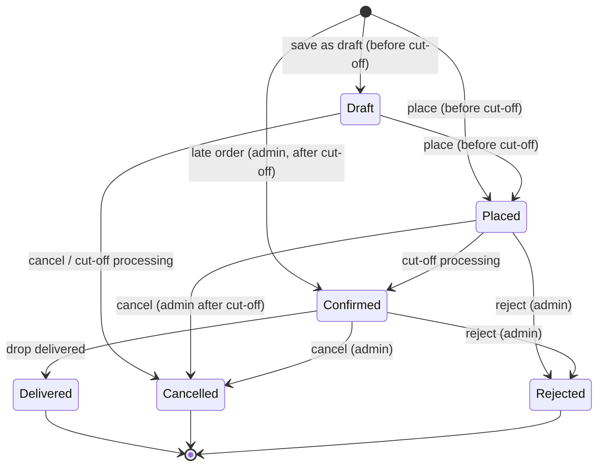
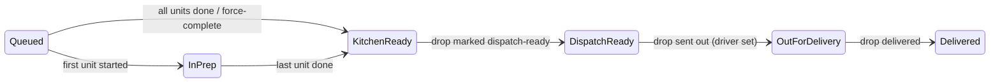

# Fernleaf Kitchen Ops — Product Requirements Document (PRD)

| | |
|---|---|
| **Product** | Fernleaf Kitchen Ops: the internal admin panel of a commercial kitchen that runs corporate meal programs |
| **Context** | Heizen engineering round (take-home). Source brief: `vault/_assets/hiring-assignment-admin-panel.pdf` (local copy, git-ignored) |
| **Version** | 1.0, planning baseline (2026-10-03 01:00 IST) |
| **Deadline** | **2026-10-04 23:59 IST** (submission form + live link + public repo) |
| **Companion docs** | [TRD](./TRD.md) · [Database models](./DATABASE_MODELS.md) · [Architecture](./ARCHITECTURE.md) |
| **Change control** | Any change to a rule/interpretation here must also be logged in `vault/05 Decisions/Decision Log.md` |

> **How to read this:** §4 lists *what* we build (FR-IDs), §5 lists the business rules (BR-IDs) every implementation and test must cite, §8 defines every dashboard figure, and §10 records how we interpreted ambiguous parts of the brief (A-IDs). The IDs are used across the TRD, the tests and the vault.

---

## 1. Summary

Fernleaf Kitchen (fictional) cooks individually boxed meals for employees of client companies and delivers them to the companies' offices. Employees never pay: every order is billed to the employee's company. The kitchen's own staff run the whole business from one internal admin panel. That panel covers the catalogue and pricing, client companies and their employees, order taking (staff order *on behalf of* employees), cooking, dispatch and delivery, and company billing.

### 1.1 Goals

| ID | Goal |
|---|---|
| G1 | **Faithful domain model.** Every rule in §5 is enforced on the server, and the rules most likely to break are covered by automated tests. |
| G2 | **Role-shaped product.** Admin, Kitchen, Dispatch and Driver each land on a dashboard built for their day and reach their main job in one click. |
| G3 | **Correct money and time.** Integer cents, totals that reconcile, one kitchen time zone, and results that don't depend on the server's or browser's time zone. |
| G4 | **Live and believable.** A deployed app whose data makes sense on *any* review day for at least two weeks after submission. |
| G5 | **Honest communication.** The README states decisions, interpretations, what was skipped and why. |

### 1.2 Non-goals (excluded by the brief, with the stand-in we use)

| Excluded | What we do instead |
|---|---|
| Employee payments, refunds | Every order is billed to the company (§4.11) |
| Several order types (family style, trays…) | Only individual boxed meals |
| Customers without a company | Every customer is an employee of exactly one company |
| Options included free with a dish | Every option is an explicit choice |
| Date-based or seasonal menus | Visibility comes only from active flags and per-company hiding |
| Pausing an employee's ordering | Not built (we do have an *inactive* employee flag) |
| Exports (CSV, prep sheets, labels, reports) | Not built (CSV *import* of employees is a [Should]) |
| Accounting / recipe-costing integrations | Invoices are internal records; costs are typed in by hand |
| Promo codes, tax, delivery fees and zones | Totals are pre-tax; the order total is the sum of its lines |
| Audit logs | Not built. We keep an **order timeline** only, because the brief requires one |
| Customer-facing app | Staff create orders in the admin panel |
| Email / notifications | Logged to the server console where an email would be sent |
| Marketing campaigns, banners | Not built |

### 1.3 Success criteria (what the reviewers will actually do)

1. Sign in with each of the four test accounts. Each sees only its role's features, and direct API calls outside that role return **403**.
2. See realistic data: several companies with employees, a real-looking menu, orders in every status across past days, **today** and the coming week, and **drops for `driver@test.com` today**.
3. Create an order end to end with option combinations. Hit server-side validation errors that point at the exact field. Save a draft, place it, edit it before the cut-off, and watch it lock after.
4. Trigger cut-off processing by hand for a date whose cut-off has passed, run it twice, and see the second run change nothing.
5. Work the kitchen board (start/done, including two people clicking at once), dispatch drops, deliver as the driver on a phone, invoice a company and mark the invoice paid.
6. Read the README: setup, architecture, data model diagram, decisions, dashboard definitions, prioritisation and ambiguities.

---

## 2. Users and roles

| Role | Who | Job to be done | Lands on | Access (summary) |
|---|---|---|---|---|
| **Admin** | Operations manager / owner | Set up the catalogue, pricing, companies, employees and staff. Take orders. Bill companies. Override anything. | Admin dashboard | Everything |
| **Kitchen** | Kitchen lead (arrives ~06:00) and cooks | Know what to cook, by when and at which station. Mark prep units started and done. | Kitchen dashboard → Kitchen board | Kitchen board and actions. Read-only dishes, allergens and orders, **without prices** |
| **Dispatch** | Dispatcher | Get cooked orders out of the door: drops, drivers, tracking. | Dispatch dashboard → Dispatch board | Dispatch board and actions. Read-only kitchen readiness, companies and orders, **without prices** |
| **Driver** | Delivery driver, on a phone | Deliver today's drops in order, and confirm each with a note and optional photo. | "My deliveries today" | Own drops for today only |

* Each staff member has **exactly one role**. Admins create staff accounts and assign roles.
* **Authorisation happens on the server, from permission codes** (turned into CASL abilities). Roles are database records that hold a set of permission codes. Adding a role is a data change; no code checks a role name (§5, BR-ACC-01).
* *Employees* are the customers. They **never sign in**. *Staff* are the users of this panel.

### 2.1 Test accounts (must exist on the live app with exactly these credentials)

| Role | Email | Password |
|---|---|---|
| Admin | `admin@test.com` | `Test@1234` |
| Kitchen | `kitchen@test.com` | `Test@1234` |
| Dispatch | `dispatch@test.com` | `Test@1234` |
| Driver | `driver@test.com` | `Test@1234` |

Each account has **only** its role's access.

---

## 3. Scope and priorities

The brief deliberately gives more scope than time. We do every **[Must]** properly before touching any **[Should]**.

| Priority | Items |
|---|---|
| **Must** | Access & staff, settings, catalogue (without portions), menu, pricing, companies, employees, orders + cut-off, kitchen board, dispatch + driver view, billing, dashboards, seeded live data, deployment, README, business-rule tests |
| **Should** | Portions (FR-CAT-05), employee CSV import (FR-EMP-03), allergy acknowledgement (FR-ORD-10), money-field filtering for non-admin roles (FR-ACC-05), demo autopilot (FR-DAT-03), regenerate demo data (FR-DAT-04), company-holiday conflict warning (FR-CMP-05), cut-off preview (FR-SET-04) |
| **Could** | Roles & permissions editor UI, OpenAPI/Swagger docs, invoice void/reissue, admin line edits after confirmation, live board updates via SSE, dish image upload, data-integrity check endpoint |
| **Won't** | Everything in §1.2 |

The phase plan with time boxes and cut lines lives in `vault/02 Phases/Phase Plan.md`.

---

## 4. Functional requirements

Format: `FR-<AREA>-nn [Priority]`, followed by acceptance notes.

### 4.1 Access and staff (ACC)

* **FR-ACC-01 [Must]** Sign in with email and password, keep the session in an httpOnly cookie, and sign out. The four accounts in §2.1 work on the live app.
* **FR-ACC-02 [Must]** Staff management (admin): list, create (name, email, role, initial password), change role, deactivate/reactivate, reset password. One role per user.
* **FR-ACC-03 [Must]** Every API endpoint declares the ability it requires (granted by permission codes), and a request without it gets **403** whatever the UI shows. Data scoping is also enforced on the server: a driver only ever receives their own drops.
* **FR-ACC-04 [Must]** A role is a record with a set of permission codes. Code never checks role names: CASL abilities are built from the codes, and every check goes through the ability. Navigation, page access and dashboard sections are derived from the user's permissions. Adding a role needs no code change.
* **FR-ACC-05 [Should]** Money fields (prices, totals, invoices) are serialised only for users with `money.read`. Kitchen, Dispatch and Driver payloads omit them.
* **FR-ACC-06 [Could]** Roles editor UI (create a role and tick its permissions).

### 4.2 Settings (SET)

* **FR-SET-01 [Must]** Admin edits kitchen working days, kitchen holidays, cut-off time and cut-off day count in the UI. Nobody edits code or the database by hand.
* **FR-SET-02 [Must]** Other platform values: kitchen buffer (default 30 min), at-risk window, on-time grace, delivery window and slot size, default dispatch lead for new companies, public-email-domain blocklist, automatic cut-off processing on/off, demo autopilot on/off. The kitchen time zone is displayed but fixed after setup.
* **FR-SET-03 [Must]** Admin-managed reference lists: allergens, dietary tags, kitchen stations, portion sizes, packaging types. Entries in use are deactivated, never deleted.
* **FR-SET-04 [Should]** Cut-off preview: pick a delivery date and see the exact lock time under the current settings.

### 4.3 Catalogue (CAT)

* **FR-CAT-01 [Must]** A dish has a name, description, image (URL), a unique internal SKU, temperature (hot/cold), cost price, allergens, dietary tags, an optional kitchen station and an optional minimum order quantity.
* **FR-CAT-02 [Must]** Dishes are deactivated and reactivated, never hard-deleted. Inactive dishes disappear from menus, while historical orders still show them.
* **FR-CAT-03 [Must]** Options are reusable choices with their own cost price, allergens and dietary tags. They are deactivated, never deleted.
* **FR-CAT-04 [Must]** Option groups belong to a dish. Each has a name, required/optional, a maximum number of selections (default 1), a display order, and the ordered list of options it offers.
* **FR-CAT-05 [Should]** Portions. A group can sell its options in sizes taken from the portion-size list. Each option defines an extra charge per size. A portioned group only accepts options that support **all** of its sizes, so adding a size the options don't support (or an option lacking a size) is rejected with a clear error.
* **FR-CAT-06 [Must]** Catalogue screens flag incomplete setup, such as a dish with no station (it will route to "Unassigned") or missing tier prices.

### 4.4 Menu (MEN)

* **FR-MEN-01 [Must]** Categories (name, slug, description) are ordered and can be activated or deactivated. Menu items, which place a dish in a category, are ordered within the category and can also be activated or deactivated. A dish may sit in more than one category.
* **FR-MEN-02 [Must]** Per company, whole categories or individual items can be hidden.
* **FR-MEN-03 [Must]** Secret categories never appear in listings but can be opened by slug (for example `chefs-table`) in the menu preview and the order builder. Hiding still applies to them.
* **FR-MEN-04 [Must]** Menu preview "as employee X" shows exactly what X would see: listed categories and items after the activation, hiding and pricing rules, priced on X's tier. Dishes clashing with X's allergies get a warning, and dishes matching X's dietary preferences get a badge.

### 4.5 Pricing (PRC)

* **FR-PRC-01 [Must]** Named price tiers. Any dish or option can have a price on any tier.
* **FR-PRC-02 [Must]** Exactly one tier is the default, enforced by the database. Switching the default is atomic.
* **FR-PRC-03 [Must]** A company may reference a tier. An employee's tier is the company's tier, or the default tier if the company has none.
* **FR-PRC-04 [Must]** A dish with no price on the employee's tier is **absent** from their menu and cannot be ordered. It is never shown at $0 or blank. An option with no price on the tier is not offered.
* **FR-PRC-05 [Must]** Derived tiers can derive from *cost × multiplier* or from *another tier ± percent*. Staff can set individual overrides or explicitly mark an item "not sold on this tier". Derived prices round **up to the next 5 cents**. Overrides are used exactly as typed.
* **FR-PRC-06 [Must]** A tier grid shows every dish (and option) with its effective price and source (override / derived / not sold / missing). It supports inline edit, bulk save, a "missing only" filter, and missing-price counts per tier.
* **FR-PRC-07 [Must]** Price changes never alter existing orders (BR-PRC-07).

### 4.6 Companies (CMP)

* **FR-CMP-01 [Must]** A company has a name, at least one email domain (unique across all companies, never a public domain), at least one delivery address (exactly one default), billing contact details (name, email, phone, address) and an **owner** who is one of its employees. The owner is created together with the company.
* **FR-CMP-02 [Must]** Calendar: working days (default Mon–Fri) and dated company holidays. Deliveries can't land on company non-working days or holidays. The company calendar **never** moves the cut-off.
* **FR-CMP-03 [Must]** Delivery defaults: default delivery time, dispatch lead minutes (minutes before delivery the order must leave the kitchen, default 60), default packaging type, standing driver instructions, and a default driver (a staff user who can perform deliveries).
* **FR-CMP-04 [Must]** Menu and price settings: the price tier, plus hidden categories and items.
* **FR-CMP-05 [Should]** Adding a company or kitchen holiday on a date that already has open orders warns and lists those orders. Nothing is cancelled automatically.

### 4.7 Employees (EMP)

* **FR-EMP-01 [Must]** An employee has a name, an email (globally unique, on one of the company's domains), a phone, exactly one company, permission flags (*can choose own delivery address*, *can change delivery time*, *can change packaging*), allergies, dietary preferences, and an active flag.
* **FR-EMP-02 [Must]** Moving an employee to another company requires an email on the new company's domains. A company owner can't be moved until ownership is transferred. New orders then follow the new company's rules, and existing orders are untouched.
* **FR-EMP-03 [Should]** CSV import per company creates the valid rows and reports each invalid row with its row number, column and message. Row errors never reject the whole file. A template download is provided.

### 4.8 Orders (ORD)

* **FR-ORD-01 [Must]** Cut-off: an order for delivery date *D* locks at the configured cut-off time on the *N*th **kitchen working day** before *D*. Kitchen holidays and non-working days are skipped when counting back. *N* and the time are settings. Example: N = 2 at 16:00 locks a Wednesday delivery on Monday at 16:00.
* **FR-ORD-02 [Must]** Order builder flow:
  1. Pick the employee.
  2. Pick the delivery date. Only deliverable, unlocked dates can be picked, with a cut-off countdown shown.
  3. See that employee's menu.
  4. Add dishes and split each one into option combinations with quantities.
  5. Choose the delivery address, time and packaging. Each is editable only where the employee's flags allow; otherwise the company default applies.
  6. See the live per-line breakdown and order total, quoted by the server.
  7. **Save draft** or **Place**.
* **FR-ORD-03 [Must]** Every rule is validated on the server when the order is saved. Errors come back keyed to the field, line or combination and are shown inline.
* **FR-ORD-04 [Must]** Statuses: Draft → Placed → Confirmed → Delivered, plus Cancelled and Rejected. Before the cut-off, Draft and Placed orders can be edited and cancelled, and a Draft can be placed. After the cut-off only an admin can change them (BR-ORD-03).
* **FR-ORD-05 [Must]** Cut-off processing for a date cancels its drafts and confirms its placed orders, which then become billable and enter the kitchen and dispatch flow. Repeated or concurrent runs are safe. It runs automatically at the cut-off, catches up after downtime, and can be triggered by an admin for any date whose cut-off has passed. Every run is logged with its counts.
* **FR-ORD-06 [Must]** Order list: server-side pagination and sorting. Search by order number, employee name/email or company. Filter by delivery date range, status (multi-select), company, and invoiced yes/no. Filters live in the URL.
* **FR-ORD-07 [Must]** Order detail shows:
  * the status, fulfilment stage and lock state;
  * the lines with their option choices and portions;
  * the money breakdown (combination → line → order), plus adjustments and the invoice link;
  * delivery details (date, time, address, packaging, drop, driver);
  * planned and actual kitchen, dispatch and delivery times;
  * a timeline of events with actor and time.
* **FR-ORD-08 [Must]** Admin override after confirmation can change the delivery time, address or packaging, until the order's drop is out for delivery. Plans are recalculated, the order moves to the matching drop, and the timeline records the before and after values.
* **FR-ORD-09 [Must]** An admin can cancel or reject a Placed or Confirmed order, with a reason. Billing follows BR-BIL-06.
* **FR-ORD-10 [Should]** Allergy safety: the builder warns when a chosen dish or option contains one of the employee's allergens, and placing then requires an explicit acknowledgement that the server checks. The kitchen board shows the flag.

### 4.9 Kitchen board (KIT)

* **FR-KIT-01 [Must]** For a chosen delivery date (default today), the board shows **prep units**: each distinct combination on each line of a Confirmed order is one unit. Units route to the dish's station, or "Unassigned" if it has none. The board filters by station and groups units by planned kitchen-ready time.
* **FR-KIT-02 [Must]** Units are marked Started and Done under BR-KIT-01..05. When two people act at the same time, one wins and the other gets a clear, non-destructive message.
* **FR-KIT-03 [Must]** An order's *kitchen started* time is its first unit's start. Its *kitchen ready* time is set only when every unit is done.
* **FR-KIT-04 [Must]** Every order shows its planned kitchen-ready and planned dispatch-ready times (BR-PLN-*). Late and at-risk work is impossible to miss, and the plan follows any delivery-time change.
* **FR-KIT-05 [Must]** An admin can force-complete a whole order.
* **FR-KIT-06 [Must]** A prep summary for the day shows totals per station → dish → combination.
* **FR-KIT-07 [Must]** The board stays responsive for a 400-order day (about 800–1,000 units).
* **FR-KIT-08 [Should]** Orders cancelled after confirmation stay on the board flagged "Do not cook" if any unit was already started; otherwise they are removed.

### 4.10 Dispatch board and driver view (DSP)

* **FR-DSP-01 [Must]** Fulfilment stages run kitchen ready → dispatch ready → out for delivery → delivered. Each step needs the previous one and none can repeat. "Out for delivery" also needs an assigned driver.
* **FR-DSP-02 [Must]** A **drop** is the set of confirmed orders with the same company, address and **exact** delivery time, and it is handled as one unit. The dispatch board lists the drops for a date with stage, readiness (x/y orders kitchen-ready), driver, planned dispatch time and lateness.
* **FR-DSP-03 [Must]** Dispatch assigns or reassigns the driver per drop. A new drop defaults to the company's default driver. Actions apply to the whole drop.
* **FR-DSP-04 [Must]** Driver view (mobile-first): the driver's own drops for today in time order, each with address, standing instructions, packaging, box count and recipients. "Mark delivered" (only when the drop is out for delivery) takes an optional note and an optional photo from the camera.
* **FR-DSP-05 [Must]** Each delivery records whether it was on time (BR-DSP-05).

### 4.11 Company billing (BIL)

* **FR-BIL-01 [Must]** Every Confirmed or Delivered order is billable, owed in full by its company.
* **FR-BIL-02 [Must]** Per company, staff see the uninvoiced billable orders and uninvoiced adjustments and select some of them (default: everything delivered up to a chosen date) to create an invoice. They can list invoices, open invoice details and mark an invoice paid.
* **FR-BIL-03 [Must]** An order, and likewise an adjustment, can be on at most one invoice. The database enforces this.
* **FR-BIL-04 [Must]** Changes after invoicing follow the documented policy (BR-BIL-04..09): invoices are immutable, and money changes become adjustments billed on the company's next invoice.
* **FR-BIL-05 [Must]** An admin records a short delivery on a delivered order, per combination, which produces a credit adjustment.

### 4.12 Dashboards (DSH)

* **FR-DSH-01 [Must]** After sign-in, every user lands on `/dashboard`, made up of the sections their permissions allow (Admin, Kitchen, Dispatch, Driver).
* **FR-DSH-02…05 [Must]** Section contents and **exact** figure definitions are in §8. The README reproduces them, along with what we chose not to show.

### 4.13 Demo data (DAT)

* **FR-DAT-01 [Must]** The live app has realistic data on any review day:
  * at least 5 companies, each with employees;
  * a realistic menu of about 25 dishes with options, groups and a secret category;
  * price tiers, including one with missing prices;
  * orders in **every** status across the past two weeks, **today** and the next 7 days;
  * drops assigned to `driver@test.com` **today**.
* **FR-DAT-02 [Must]** Data stays fresh without manual work, through rolling and idempotent generation. Reviewer-created data is never deleted automatically.
* **FR-DAT-03 [Should]** Demo autopilot: today's seeded orders progress through kitchen, dispatch and delivery in step with the clock, while a share of work is left for reviewers in every role. Its actions are labelled "Demo autopilot" in timelines, and it can be switched off in Settings.
* **FR-DAT-04 [Should]** An admin can regenerate demo data. Only demo transactional data is reset.

---

## 5. Business rules (canonical, testable)

Tests are named after these IDs (for example `it('BR-CUT-01: Wednesday with N=2 locks Monday 16:00')`).

### 5.1 Money (BR-MNY)

* **BR-MNY-01** Every amount is an **integer number of cents** (USD). No floating point is used in storage or arithmetic.
* **BR-MNY-02** Combination unit price = dish price + Σ chosen option prices (+ portion extra charges). Combination total = unit price × quantity. Line total = Σ combination totals. **Order total = Σ line totals.** There is no tax, fee or discount.
* **BR-MNY-03** **Invoice total = Σ invoice line amounts.** An order line's amount equals that order's total. An adjustment line's amount equals the adjustment.

### 5.2 Pricing (BR-PRC)

* **BR-PRC-01** Employee tier = company tier if set, else the default tier. There is **no per-item fallback** to another tier.
* **BR-PRC-02** The effective price of item *X* on tier *T* is resolved as follows:
  1. If *T* has an explicit entry for *X*, use that price, or "not sold" if the entry is an explicit exclusion.
  2. Otherwise, if *T* is MANUAL, there is no price.
  3. If *T* is FROM_COST, the price is `ceil5(cost(X) × factor)`.
  4. If *T* is FROM_TIER, the price is `ceil5(price(X, base) × factor)`. If the base tier has no price, neither does *T*.
* **BR-PRC-03** `ceil5(v)` is the smallest multiple of 5 cents that is ≥ *v*, computed with integer arithmetic. For example 211.2¢ → 215¢, 215¢ → 215¢ and 295.2¢ → 300¢.
* **BR-PRC-04** A dish price must be **> 0** to count as a price. An option price may be 0.
* **BR-PRC-05** Derivation chains are acyclic, and a tier cannot derive from itself.
* **BR-PRC-06** Exactly one default tier exists at all times.
* **BR-PRC-07** Prices are **captured** on each combination when it is first added to an order, and the tier used is recorded on the order. Later catalogue or price changes never alter them. When an open order is edited, unchanged combinations keep their captured prices, and new or changed combinations are priced at the current prices.

### 5.3 Menu visibility (BR-MEN)

* **BR-MEN-01** A dish is visible to an employee only when all of these hold:
  * the dish is active;
  * it has at least one active menu item in an active category;
  * neither that category nor that item is hidden for the employee's company;
  * the dish has a price on the employee's tier;
  * every required option group has at least one offered option (BR-MEN-03).
* **BR-MEN-02** Secret categories are excluded from listings. They can be reached by slug unless they are inactive or hidden for the company.
* **BR-MEN-03** A group's offered options are the active options listed in the group that have a price on the tier, and that support every group size if the group is portioned.
* **BR-MEN-04** Order validation and the menu preview call the **same** visibility function, so there is one source of truth.

### 5.4 Combinations (BR-CMB)

* **BR-CMB-01** An order has at most one line per dish. Each line has at least one combination. **Σ combination quantities = line quantity**, and every quantity is a positive integer.
* **BR-CMB-02** Every combination satisfies **every required group** (at least one choice) and respects each group's maximum selections. No option appears twice in a group. Choices come only from the dish's groups and the options those groups offer.
* **BR-CMB-03** In a portioned group, every choice names one of the group's sizes. In a non-portioned group, no choice names a size.
* **BR-CMB-04** Each combination is turned into a canonical *signature*, sorted by group order then option order. Identical combinations on the same line are merged, so every combination on a line is distinct and is exactly one prep unit.
* **BR-CMB-05** Line quantity ≥ the dish's minimum order quantity, when one is set.

### 5.5 Companies and employees (BR-CMP, BR-EMP)

* **BR-CMP-01** Email domains are stored lower-case, are valid host names, are unique across all companies, and are not on the public-domain blocklist.
* **BR-CMP-02** A company always has at least one domain, at least one active address, exactly one default address, and an owner who is one of its employees.
* **BR-CMP-03** A default or assigned driver must be an active staff user whose role grants `delivery.perform`. Roles are not checked by name.
* **BR-EMP-01** An employee's email is unique and its domain belongs to the employee's company. This is checked on create, update, move and import.
* **BR-EMP-02** The owner of a company can't be moved or deactivated until ownership is transferred.
* **BR-EMP-03** Moving an employee never changes existing orders: the billing party, address and prices stay as they were.

### 5.6 Calendar and cut-off (BR-CAL, BR-CUT)

* **BR-CAL-01** A date is **deliverable** for a company only when it is:
  * a company working day and not a company holiday;
  * a **kitchen** working day and not a kitchen holiday;
  * not in the past (kitchen time zone).
* **BR-CUT-01** `cutoffAt(D)` is the cut-off time (kitchen time zone) on the *N*th kitchen working day **strictly before** *D*, skipping kitchen non-working days and holidays. When N = 0 it falls on *D* itself.
* **BR-CUT-02** The company calendar never affects `cutoffAt`.
* **BR-CUT-03** An order is **locked** once `now ≥ cutoffAt(deliveryDate)`. This is computed from the clock and does not depend on processing having run.
* **BR-CUT-04** Processing date *D* is allowed only when `now ≥ cutoffAt(D)`. It moves DRAFT → CANCELLED (reason "Cut-off") and PLACED → CONFIRMED (sets `confirmedAt`, assigns a drop, makes the order billable). Re-running it changes nothing, concurrent runs for the same *D* are serialised, and every run is logged.
* **BR-CUT-05** While automatic processing is on, each passed cut-off is processed at its time, or at the next opportunity (startup or request catch-up) if the API was asleep.

### 5.7 Order lifecycle (BR-ORD)

* **BR-ORD-01** Only users with `orders.create` create orders, and only for active employees of active companies on deliverable dates.
* **BR-ORD-02** Before the cut-off:
  * an order can be created as Draft or Placed;
  * Draft and Placed orders can be edited, with optimistic concurrency via `version`;
  * a Draft can be placed;
  * Draft and Placed orders can be cancelled.
* **BR-ORD-03** After the cut-off (locked), non-admins can't create, edit, place or cancel. Users with `orders.override` (Admin) may:
  * create a **late order**, which is created directly as **Confirmed**;
  * cancel or reject a Placed or Confirmed order;
  * override the delivery time, address or packaging of a Confirmed order.

  A draft can't be created for a locked date. Lines of a Confirmed order are not edited (A-19).
* **BR-ORD-04** Employee flags apply on create and edit. Without *can choose address*, the company's default address is used. Without *can change time*, the company's default time is used. Without *can change packaging*, the company's default packaging is used. A chosen address must be an active address of the company. A chosen time must fall inside the delivery window on a slot boundary. A chosen packaging type must be active.
* **BR-ORD-05** Overrides are allowed until the order's drop is out for delivery. They recompute plans and reassign the drop (BR-DSP-06).
* **BR-ORD-06** Cancelled, Rejected and Delivered are terminal. A Delivered order can't be cancelled; record a shortage instead (BR-BIL-07).
* **BR-ORD-07** Every status or stage change appends a timeline event recording who, when and what.

### 5.8 Planning and lateness (BR-PLN)

* **BR-PLN-01** `plannedDispatchReadyAt = deliveryAt − company.dispatchLeadMinutes`.
* **BR-PLN-02** `plannedKitchenReadyAt = plannedDispatchReadyAt − settings.kitchenBufferMinutes` (default 30).
* **BR-PLN-03** Plans are stored on the order and recomputed whenever the delivery time changes, and again at confirmation.
* **BR-PLN-04** A step is **late** when it is not done and `now > planned`. It is **at risk** when it is not done and `planned − atRiskWindow ≤ now ≤ planned`. The kitchen step is "unit done" against planned kitchen-ready. The dispatch step is "drop out for delivery" against planned dispatch-ready.

### 5.9 Kitchen (BR-KIT)

* **BR-KIT-01** Only units of **Confirmed** orders can be started or completed.
* **BR-KIT-02** *Start* works only on a unit that hasn't started. *Done* works only on a unit that isn't done; if the unit never started, the start is recorded at the same instant.
* **BR-KIT-03** `Order.kitchenStartedAt` is the earliest unit start, set once. `Order.kitchenReadyAt` is set when the last unit is done, and never before.
* **BR-KIT-04** Force-complete (admin) marks all remaining units done now (recording starts where missing), sets `kitchenReadyAt` and records an event.
* **BR-KIT-05** Concurrent actions on the same unit or order are serialised, so exactly one succeeds and the rest get a conflict error.

### 5.10 Dispatch and delivery (BR-DSP)

* **BR-DSP-01** The drop key is (company, address, exact delivery instant). A drop is created when its first order is confirmed (or moved by an override), with driver = the company's default driver.
* **BR-DSP-02** *Dispatch-ready* (per drop) requires every non-cancelled order in the drop to be kitchen-ready. It can't be repeated.
* **BR-DSP-03** *Out for delivery* requires the drop to be dispatch-ready and to have a driver. It can't be repeated.
* **BR-DSP-04** *Delivered* requires the drop to be out for delivery. It can be set by the assigned driver, or by dispatch or an admin. Every non-cancelled order in the drop becomes Delivered. The note and the photo are optional.
* **BR-DSP-05** A drop is **on time** when `deliveredAt ≤ deliveryAt + onTimeGraceMinutes`. This is stored at delivery and never recomputed.
* **BR-DSP-06** An order joining a drop that is already dispatch-ready must itself be kitchen-ready. Joining a drop that is out for delivery or delivered is refused.
* **BR-DSP-07** A driver can read and act only on drops assigned to them, for **today**.

### 5.11 Billing (BR-BIL)

* **BR-BIL-01** Billable orders are those with status Confirmed or Delivered. The billable amount is the order total.
* **BR-BIL-02** An invoice belongs to one company and contains only that company's uninvoiced billable orders and uninvoiced adjustments. Its total is Σ lines. Invoice numbers are sequential.
* **BR-BIL-03** An order or adjustment can be on **at most one invoice** (unique constraint). If the same order is invoiced concurrently, all but one attempt fail.
* **BR-BIL-04** Invoices are **immutable** once issued. The only transition is Issued → Paid.
* **BR-BIL-05** Once an order is invoiced, its lines and prices can't change.
* **BR-BIL-06** Cancelling or rejecting an **invoiced** order creates a credit adjustment of −(order total). A cancelled or rejected order that was **not yet invoiced** just stops being billable.
* **BR-BIL-07** A short delivery (admin) records the short quantity per combination, which must not exceed the ordered quantity. The credit is −Σ(short qty × combination unit price), and an order's total credits can never exceed its total.
* **BR-BIL-08** Non-money changes (time, address, packaging, driver) never affect billing.
* **BR-BIL-09** Uninvoiced adjustments appear in the company's uninvoiced list and are billed on its next invoice.

### 5.12 Access (BR-ACC)

* **BR-ACC-01** Authorisation is derived only from permission codes (CASL abilities are built from them). Roles are data.
* **BR-ACC-02** Inactive users can't sign in. Deactivation, a role change or a password reset takes effect on the user's next request (via the session token version).
* **BR-ACC-03** Users without `money.read` never receive money fields.

---

## 6. State models

### 6.1 Order status

### 6.2 Fulfilment stage (only while Confirmed → Delivered)

The stage is **derived**: kitchen fields come from the order, and dispatch fields come from its drop.

### 6.3 Invoice

`Issued → Paid`. Corrections are made through adjustments on later invoices, never by editing an existing invoice.

---

## 7. Key user flows

| Flow | Steps |
|---|---|
| **F1: Take an order (Admin)** | Orders → New → pick employee (search) → pick date (calendar greys out non-deliverable or locked dates and shows the cut-off) → browse the employee's menu → add dish → split into combinations (e.g. 6 × brown rice + 4 × jeera rice) → delivery options (only where the flags allow) → review the breakdown → Save draft / Place |
| **F2: Morning in the kitchen (Kitchen lead, 06:00)** | Dashboard: today's meals per station, prep summary, first deadlines, allergen watch → Kitchen board filtered to my station → start/done units → late/at-risk units in red/amber at the top |
| **F3: Get food out (Dispatch)** | Dashboard: drops by stage, next departures, unassigned drops → Dispatch board → assign drivers → mark drops dispatch-ready when all their orders are kitchen-ready → send out for delivery |
| **F4: Deliver (Driver, phone)** | "My deliveries today" in time order → open drop → address and instructions → Mark delivered with note and photo → next stop |
| **F5: Cut-off (system / Admin)** | Automatic at the cut-off time → Cut-off page shows each date's lock time and run history → admin can "Run now" for any passed cut-off, and a second run shows 0 changes |
| **F6: Bill a company (Admin)** | Billing → company → uninvoiced orders and adjustments → select (default: delivered up to a date) → Create invoice → Mark paid when settled |
| **F7: Set up a client (Admin)** | Companies → New (company + owner employee) → domains, addresses, calendar, delivery defaults, tier, hidden menu → Employees (manual or CSV) → Menu preview as an employee |

---

## 8. Dashboards: figures and exact definitions

These definitions go into the README as they are. They are written so a reviewer can recompute every number.

### 8.1 Conventions (apply to every figure unless stated)

* **Time zone:** Asia/Kolkata. "Today" is the kitchen-local date on the **server** when the request arrives.
* **Date grouping:** by the order's **delivery date**, never its creation date.
* **Active orders** are Confirmed + Delivered. The **pipeline** is Draft + Placed. **Cancelled and Rejected orders are excluded** from every count and sum unless a figure says otherwise.
* **Meals** = Σ combination quantities, where one meal is one boxed meal.
* **Money** = Σ stored integer cents, shown in USD. Order sums are gross (before adjustments), and adjustments are shown as their own figure.
* A **drop** counts only if it holds at least one non-cancelled order.
* **Missing data is shown, not hidden:** dishes without a station appear as "Unassigned", drops without a driver as "No driver", and a ratio with no denominator shows "—" (never 0% or 100%).

### 8.2 Admin: "Is today on track, what needs me, are we getting paid?"

| Figure | Exact definition | Why the admin needs it |
|---|---|---|
| Orders today / Meals today | Count of active orders with deliveryDate = today / Σ meals of those orders | Size of today's service |
| Delivery progress | Delivered drops ÷ all drops for today | Is service on track? |
| On-time rate (today, last 7 days) | Drops with `deliveredOnTime = true` ÷ drops delivered, grouped by drop delivery date; "—" if none delivered | Service quality, client retention |
| Late right now | Kitchen units late + drops late, per BR-PLN-04, for today | Needs intervention now |
| Next cut-off | Earliest future `cutoffAt` among the next deliverable dates, with that date's Draft count ("will be cancelled") and Placed count ("will be confirmed") | Chase incomplete drafts before they expire |
| Cut-off processing pending | Dates with `cutoffAt ≤ now` that still have Draft/Placed orders (should be 0; shows a "Run now" action) | Integrity alarm |
| Next 7 days pipeline | For each date today+1..today+7: Confirmed / Placed / Draft counts and meals; kitchen holidays flagged | Capacity and purchasing |
| Booked revenue | Σ `totalCents` of active orders by delivery date: last 14 days (actuals) and next 7 days (Confirmed only). Week-over-week comparison uses Mon–Sun weeks | Demand trend |
| Uninvoiced | Σ billable orders with no invoice line + Σ uninvoiced adjustments; top 5 companies | Cash collection |
| Open invoices | Count and Σ of Issued invoices; age of the oldest (`issuedAt`) | Chase payments |
| Paid (30 days) | Σ invoices with `paidAt` within the last 30 days | Cash in |
| Setup gaps | (a) dishes on an active menu item with no price on a tier used by ≥1 company (or the default tier); (b) companies without a default driver; (c) active dishes without a station | Prevents "why can't they see X?" calls |

**Not shown, and why:** profit or margin (costs are typed by hand and option costs are often missing, so the number would mislead); per-employee spend (not needed for operations, and a privacy concern); forecasts and decorative charts that don't lead to a decision.

### 8.3 Kitchen: "What do I cook, by when, where are we behind?"

(The date selector defaults to today; tomorrow is one click away.)

| Figure | Exact definition | Why |
|---|---|---|
| Production status | Units and meals by state (not started / in progress / done) over **Confirmed** orders for the date, per station including "Unassigned" | Know the load per station |
| Next deadlines | The next 3 distinct `plannedKitchenReadyAt` slots ≥ now, with outstanding (not done) meals per station | Sequence the work |
| Late / at risk | Count of units late / at risk (BR-PLN-04); clicking opens the filtered board | Fix bottlenecks first |
| Prep summary | Station → dish → combination (options and portions) → Σ quantity over not-cancelled units, ordered by the earliest planned kitchen-ready | "Cook 46 paneer bowls, brown rice, large" |
| Allergen watch | Meals per allergen (dish allergens ∪ chosen-option allergens); list of combinations whose allergens intersect the **employee's** recorded allergies (employee, dish, allergen) | Safety |
| Tomorrow | Confirmed meals by station. If tomorrow's cut-off hasn't passed, Placed meals are listed separately as "may still change" | Prep planning |

Orders cancelled after confirmation are listed separately as "Do not cook" if work had started. **Not shown:** prices, revenue, billing, customer contact details.

### 8.4 Dispatch: "What leaves next, who drives it, what's late?"

| Figure | Exact definition | Why |
|---|---|---|
| Drops today by stage | Drops for today counted by derived stage: *Waiting on kitchen* (≥1 order not kitchen-ready), *Ready to stage* (all kitchen-ready, not dispatch-ready), *Dispatch-ready*, *Out for delivery*, *Delivered* | Pipeline at a glance |
| Late / at risk drops | Drops not yet out for delivery that are late / at risk against their planned dispatch-ready (BR-PLN-04) | Act before it's late |
| No driver | Drops today and tomorrow with no driver | Assign drivers in time |
| Next departures | The next 5 not-out drops by planned dispatch-ready, with readiness (x/y orders kitchen-ready) and driver | Order of work |
| Driver load | Per driver, today: assigned / out / delivered / on-time | Balance the routes |
| On-time today | On-time drops ÷ delivered drops today; "—" if none | Quality |

**Not shown:** money, and menu details beyond box counts.

### 8.5 Driver: "Where do I go next?"

| Figure | Exact definition | Why |
|---|---|---|
| My drops today | Count of drops assigned to me with delivery date = today; delivered vs remaining | Progress |
| Next stop | The earliest of my not-delivered drops: time, company, address, boxes, instructions | Go |
| On time today | My on-time drops ÷ my delivered drops today; "—" if none | Feedback |

**Not shown:** other drivers' drops, prices, billing.

---

## 9. Non-functional requirements

| ID | Requirement | How we meet it (details in the TRD) |
|---|---|---|
| NFR-01 | **Money correctness:** no floating point; order = Σ lines; invoice = Σ lines | Integer cents everywhere, integer `ceil5`, totals computed in one domain module, DB CHECKs, reconciliation tests |
| NFR-02 | **Time zones:** cut-offs, delivery dates and "today" are correct whatever the server or browser time zone. The assumed zone is stated | Kitchen TZ in settings (Asia/Kolkata), DATE columns for kitchen-local dates, instants as `timestamptz`, server-provided clock; tests run under different `TZ` env values |
| NFR-03 | **Concurrency:** simultaneous actions never corrupt orders or units | Conditional updates, row locks, unique constraints, optimistic versioning, advisory lock per cut-off date |
| NFR-04 | **Validation:** on the server, with actionable errors | Shared Zod schemas plus domain validation; one error envelope with field paths; inline display |
| NFR-05 | **Performance:** server-side pagination; kitchen board responsive at 400 orders | Paginated list APIs, indexed queries, a single board query, grouped and memoised UI; a measured perf script |
| NFR-06 | **Code quality:** clear module boundaries, shared types, consistent errors, clean lint and type-check | One repo (`frontend/`, `backend/`, `shared/`), NestJS modules per domain, CI running lint, typecheck, test and build |
| NFR-07 | **Tests:** cut-off, pricing, combinations, invoicing (+ concurrency/idempotency) | Vitest unit tests on pure domain functions, plus integration tests against a Neon test branch |
| NFR-08 | **Availability:** live for two weeks or more after submission | Vercel + Render + Neon free tiers with a keep-alive monitor and a DB-frugal job design |
| NFR-09 | **Security:** server-side authorisation, safe sessions | httpOnly + Secure + SameSite=Lax cookie through a same-origin proxy, hashed passwords, login rate limit, Origin check on mutations |
| NFR-10 | **Usability:** fast for the real people in §2; driver view usable on a phone | Role dashboards, keyboard-friendly tables, large touch targets on the driver view, status colours plus text labels |

---

## 10. Assumptions and interpretations (ambiguities)

Each entry is mirrored in the README. Changes go through the Decision Log.

| ID | Topic | Our interpretation | Why |
|---|---|---|---|
| A-01 | Time zone & currency | Kitchen TZ **Asia/Kolkata (IST, UTC+05:30)**; currency **USD** as written in the brief; integer cents; no tax or fees | Reviewers' "today" is IST; the brief's examples are in $ |
| A-02 | Kitchen calendar in the demo | Seeded kitchen works **7 days a week**; companies have their own calendars (most Mon–Fri, some 7-day) | Any review day, weekends included, has live operations and driver drops. It is data, so Settings can change it |
| A-03 | Staff vs employees | Staff are users of this panel and sign in. Employees are customers who never sign in | Matches "no customer-facing app" |
| A-04 | Who takes orders | Only Admins (`orders.create`) | The brief lists order creation under Admin |
| A-05 | Option groups | Groups belong to one dish; the **option** is the reusable part | The brief says options are reusable and "a dish has groups" |
| A-06 | Group cardinality | Required means at least 1 choice. `maxSelections` defaults to 1 (pick one) and can be raised for add-on groups | Covers "choose your protein" and "add sides" |
| A-07 | Portion pricing | Extra charge per option and size, the same on every tier, added to the option's tier price | Simplest model consistent with "extra charge on top of the option's own price" |
| A-08 | Lines per dish | At most one line per dish per order; identical combinations in a line are merged | Keeps "each distinct combination is one unit" true by construction |
| A-09 | Minimum order quantity | Applies to the line (that dish's total in one order) | Only scope available on an order |
| A-10 | Hiding semantics | Hiding a category hides its items. Hiding beats secret. Item hiding is per placement, so a dish placed in two categories stays reachable through the visible one | Literal reading of "a category or item can be hidden" |
| A-11 | "Secret but reachable" | Secret categories are opened by slug in the preview and the order builder; they're never listed | An admin panel has no public link to share |
| A-12 | Unpriced options | An option without a price on the tier is not offered. If a required group ends up empty, the dish is hidden | The no-price rule from §4.3 applied consistently |
| A-13 | Derived prices | Rule: base × factor, where the base is cost or another tier's price. Rounded up to the next 5¢. Overrides used as typed. Explicit "not sold on this tier" supported. A dish price ≤ 0 counts as missing. No fallback to the default tier | Reads rules 4–6 together without contradiction |
| A-14 | Price capture on edits | Unchanged combinations keep their captured price; new or changed ones use current prices | "Changes affect new orders only" while orders stay editable |
| A-15 | Deliverable dates | Must satisfy **both** calendars (company and kitchen) | The kitchen can't cook on its own holidays |
| A-16 | Counting cut-off days | Count kitchen working days strictly before the delivery date; N = 0 means the cut-off is on the delivery day | Matches the brief's example (Wed, N = 2 → Mon) |
| A-17 | Lock vs processing | Locking is time-based. Processing does the status changes | No window where a stale order can still be edited |
| A-18 | Orders after cut-off | Admin "late orders" are created directly as Confirmed. Drafts for locked dates aren't allowed | After processing, Placed/Draft orders for that date can't exist, which keeps processing idempotent |
| A-19 | Admin powers after cut-off | Cancel, reject, and override time, address or packaging. **No line edits after confirmation** (cancel and re-create instead, or record a shortage) | Line edits would desync kitchen units and billing; listed as [Could] |
| A-20 | Rejected vs Cancelled | *Rejected*: the business refuses an order it can't fulfil (with a reason). *Cancelled*: withdrawn by staff, or a draft expiring at cut-off. Neither is billable | Gives both statuses a distinct meaning |
| A-21 | Employee flags | Addresses are chosen from the company's addresses, not typed freely. Times fall inside the delivery window on 15-minute slots. Packaging comes from the active types. Admin overrides after confirmation ignore the flags | Keeps drops meaningful; overrides are admin powers |
| A-22 | Fulfilment stages | Kitchen ready → dispatch ready → out for delivery are sub-stages of **Confirmed**. *Delivered* is both the last stage and a status | Reconciles the two lists in the brief |
| A-23 | Drops | Persisted, keyed by company + address + exact delivery instant, created at confirmation. Dispatch actions apply to the whole drop. Overrides move orders between drops (BR-DSP-06) | Handled together and assigned once |
| A-24 | On time | Delivered at or before the scheduled time + grace (setting, default 5 min). Stored at delivery | "Record whether each delivery was on time" |
| A-25 | Late / at risk | BR-PLN-04, with a configurable window (default 30 min) | Makes "obvious" measurable |
| A-26 | Invoiced orders that change | Invoices are immutable. Money changes become credit adjustments on the next invoice. Non-money changes don't touch billing | Standard credit-note practice; keeps totals reconcilable |
| A-27 | When to invoice | Billable from confirmation. Default selection is delivered orders up to a date, but confirmed future orders can be included | "Every confirmed order is owed in full" |
| A-28 | Moving employees | Needs an email on the new company's domain. Owners must hand over ownership first. History is unchanged | Domains define membership |
| A-29 | Company owner | Created together with the company, and must be one of its employees | No ownerless companies |
| A-30 | Public domains | A blocklist (gmail.com, yahoo.com, outlook.com…) editable in Settings | Admin-managed without code |
| A-31 | Demo freshness | A rolling window (−14…+7 days) topped up daily and idempotently. Optional autopilot advances seeded orders with the clock. Reviewer data is never auto-deleted | "Today" is whatever day they review |
| A-32 | Delivery photos | Compressed in the browser and stored in Postgres (≤ 1 MB) | No extra service; production would use object storage |
| A-33 | Who sees money | Only roles with `money.read` (Admin by default) | Kitchen, Dispatch and drivers don't need prices |
| A-34 | Dish images | A URL field. Seeded images ship with the web app. No upload | Out of the time budget |
| A-35 | Notifications | Logged to the console where an email would be sent (e.g. invoice issued) | Allowed by the brief |
| A-36 | Plan storage | Planned times are stored on the order and recomputed on every delivery-time change and at confirmation | Stable history plus fast board queries |
| A-37 | Holiday added after orders | Warn and list the affected open orders; nothing is cancelled automatically | Destructive automation is risky |
| A-38 | Kitchen buffer | The "30 minutes" in the brief is the default of a setting | Platform value; no code change needed |
| A-39 | Allergy conflicts | Warn and require an acknowledgement; the order isn't blocked | Some "allergies" are intolerances; the human decides |
| A-40 | Order's company | Captured at creation (billing party) | Moving employees must not move history |

---

## 11. Risks and mitigations

| Risk | Impact | Mitigation |
|---|---|---|
| Scope far exceeds 48 h | Unfinished Musts | Phase plan with checkpoints and cut lines. Shoulds only after every Must works end to end. Deploy early |
| Neon free plan: 100 CU-hours/month, scale-to-zero after 5 min | DB suspended mid-review if it never sleeps | `/api/health` never touches the DB. Timers instead of polling. Request-driven catch-up. 0.25 CU fixed compute |
| Render free: sleeps after 15 min idle, ~1 min cold start | First reviewer request hangs | External keep-alive monitor every 5–10 min; 750 free hours covers one always-on service |
| "Today" moves after submission | Empty boards on review day | Rolling generator (bootstrap and nightly) plus a 7-day kitchen in the seed |
| Weekend reviews | No deliveries | 7-day kitchen, 7-day client companies, `driver@test.com` as their default driver |
| Prisma DATE / time-zone bugs | Wrong cut-offs | Central date helpers; tests run under several `TZ` values |
| Cross-site cookies | Login failing in some browsers | Same-origin `/api` proxy through Next.js rewrites |

---

## 12. Deliverables checklist (from the brief)

- [ ] Live link with the four test accounts working and limited to their role
- [ ] Realistic data on the review day (every status, today, next week, driver drops today)
- [ ] Public Git repository with a clean, meaningful commit history
- [ ] README: local setup · architecture overview + data model diagram · key decisions and trade-offs · dashboard definitions (§8) · prioritisation (built / skipped / why / next) · ambiguities and interpretations (§10) · assumed time zone · billing policy for changed invoiced orders
- [ ] Google Form submitted before 2026-10-04 23:59 IST
- [ ] Live link kept running for at least 2 weeks after submission
